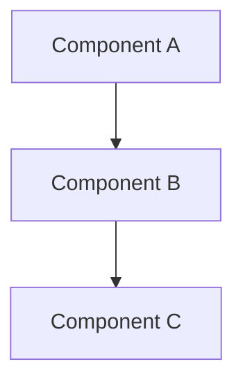

# [Title]: How We Built [System]

---

## 📌 Metadata

- **System/Feature**: [Name]
- **Scale**: [e.g., 800M users, 1M QPS]
- **Reading Time**: [X] min read
- **Date**: [YYYY-MM-DD]

---

## Problem Background

[2-3 paragraphs: What problem are we solving? Why now? What was the context?]

**Current State**: [Description of existing solution and its pain points]

> "The key challenge was: [one-sentence problem summary]"

---

## System Architecture

[Architecture overview description]

**Core Components:**

1. **[Component 1]**: [Responsibility and role]
2. **[Component 2]**: [Responsibility and role]
3. **[Component 3]**: [Responsibility and role]

---

## Key Challenges

### Challenge: [Challenge Title]

[Describe the problem and its impact on the system]

**_Impact_**: [How this affected users or the system]

**_Solution_**: [What we did to solve it]

[Technical details, code snippets, or configuration examples]

---

### Challenge: [Challenge Title]

[Same structure as above]

---

## Results

### Performance Improvements

| Metric | Before | After | Improvement |
|--------|--------|-------|-------------|
| Latency (p99) | [X]ms | [Y]ms | [Z]% ↓ |
| Throughput | [X] QPS | [Y] QPS | [Z]x ↑ |
| Cost | $[X] | $[Y] | [Z]% ↓ |

### Reliability

- Uptime: [Percentage] over [period]
- SEV-0 incidents: [Number] in [period]

---

## What We Learned

**✅ What Worked:**
- [Success 1]
- [Success 2]

**❌ What Didn't:**
- [Failure 1] → [How we fixed it]
- [Failure 2] → [How we fixed it]

---

## Looking Forward

[Next steps, future plans, what's coming next]

---

## Acknowledgements

[Thank team members, collaborators, or contributors]
