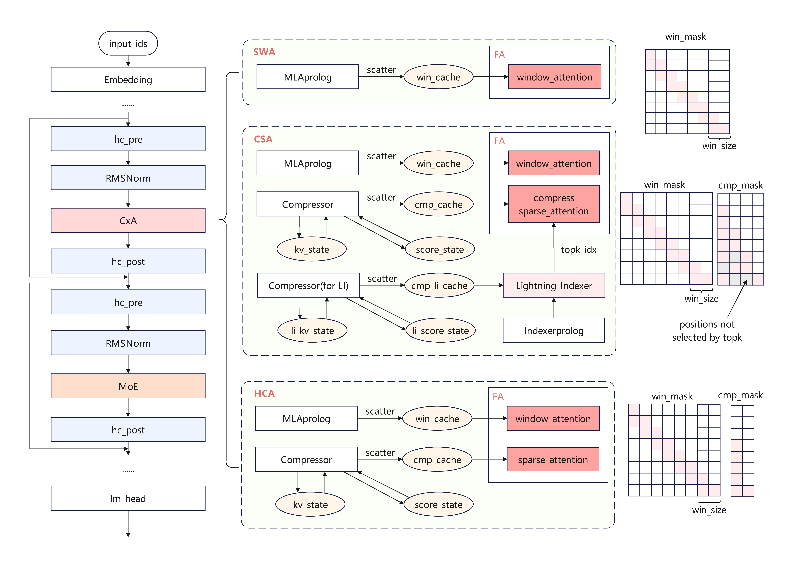
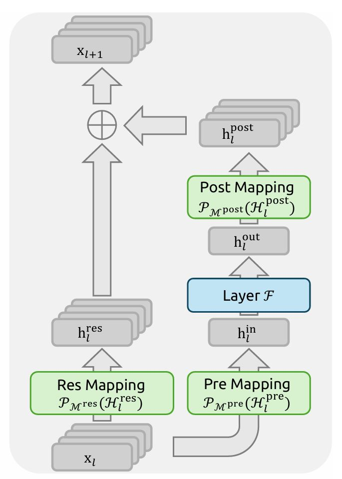

# DeepSeek-V4 的核心不是更大的 MoE，而是重写 long-context 的 cost curve

论文的正式标题是 `DeepSeek-V4: Towards Highly Efficient Million-Token Context Intelligence`，PDF 原文可见：<https://huggingface.co/deepseek-ai/DeepSeek-V4-Pro/blob/main/DeepSeek_V4.pdf>。这个标题本身其实已经把讨论边界说得很清楚了：重点不是更大的参数规模，而是 million-token context 在效率上的可实现性。

如果要先用一句话概括这篇工作的核心贡献，那就是：它试图突破现有大模型在处理超长上下文时的效率瓶颈，并且把这个目标同时落实到模型结构、训练稳定性和运行时实现里。

更具体地说，通过采用混合的 `CSA` 和 `HCA`，再加上对计算和存储的精度优化，与 `DeepSeek-V3.2` 相比，`DeepSeek-V4` 系列实现了显著更低的推理 FLOPs 和大幅缩小的 KV cache 大小，尤其是在长上下文场景下。

DeepSeek-V4 的关键不在于参数继续做大，也不在于引入一个孤立的新注意力模块。它真正改变的是 long-context 的问题定义：问题不再只是模型能不能看到更长的上下文，而是模型结构、残差路径、KV cache、专家并行和运行时能不能一起把成本压到可部署区间。换句话说，DeepSeek-V4 讨论的核心不是模型规模，而是服务成本曲线。

如果把发布背景也算进去，这次还有一个很强的额外感受。大概从春节前开始，外部就一直处在一种“V4 下周就发”的等待里。真正发出来以后，我印象最深的反而不是某个 headline，而是官方稿件里那句「不诱于誉, 不恐于诽, 率道而行, 端然正己。」这句话和 V4 本身的工程气质很一致：少一点姿态，多一点把路线走通。引文来源可参见官方公众号稿件和官方新闻页：

- DeepSeek-V4详细分析(1): 算法和模型结构：<https://mp.weixin.qq.com/s/F-0_bbwvQjlYaHVFW_uPNw>
- DeepSeek API Docs 新闻页：<https://api-docs.deepseek.com/zh-cn/news/news260424>



*图 1：这张图更适合按“哪些路径被一起重写”来读，而不是按“又多了几个模块”来读。重点是 long-context、残差稳定性和 serving 路径被放进了同一个设计里。*

## 1. Overview

### 1.1 模型架构创新

DeepSeek-V4 的出发点不是单纯扩展参数规模，而是解决 million-token context 在工程上最难落地的那部分问题：推理 FLOPs、KV cache、数值稳定性以及长上下文下的路径分工。总体而言，DeepSeek-V4 系列保留了 Transformer 主干和多 Token 预测（`MTP`）模块，同时在 DeepSeek-V3 的基础上引入了几项关键升级。

#### 1.1.1 `mHC`

第一项升级是引入流形约束超连接（`mHC`）来增强传统残差连接。长上下文压缩、MoE、混合精度和定制 kernel 一旦叠加，残差路径本身就会变成训练稳定性的关键变量。`mHC` 的作用不是单纯增加结构复杂度，而是把残差稳定性显式写进架构。



*图 2：`mHC` 的意义不是“结构更花”，而是它把残差稳定性提升成了基础设施。没有这个前提，前面的 long-context 收益很可能只能停留在图上。*

#### 1.1.2 混合注意力架构

第二项升级是混合注意力。DeepSeek-V4 没有把 attention 当成单一路径，而是拆成了职责不同的多条路径：

- 近场路径保精度
- 中远场路径做压缩和选择
- 极远场路径进一步做高倍率摘要

具体来说，`CSA` 负责“压缩 + 稀疏选择 + 局部窗口”的平衡，`HCA` 负责在更长路径上进一步做高倍率压缩。这个设计的关键不是又加了两个新模块，而是承认不同距离的上下文不应该共享同一种表示和访问语义。

#### 1.1.3 模型架构带来的优势

通过采用混合的 `CSA` / `HCA`，再叠加 `mHC` 带来的稳定残差路径，以及后续计算和存储精度优化，DeepSeek-V4 相比 DeepSeek-V3.2 在长上下文下实现了更低的推理 FLOPs 和更小的 KV cache。它真正推进的是“长上下文能否进入可部署区间”，而不是“模型能否看到更多 token”。

### 1.2 训练时的优化

训练侧的优化不只是换一个优化器。`Muon`、iterative clip、张量级 checkpointing、混合 `ZeRO`、低成本 `mHC` 重计算、以及两阶段上下文并行，这些东西一起决定了前面的结构能不能在训练时稳定放大。

尤其要强调的是，DeepSeek-V4 的注意力架构允许直接在 attention query 和 KV 条目上应用 `RMSNorm`。这显著降低了 attention logits 爆炸的风险，因此 `Muon` 优化器这里不再需要采用 `QK-Clip` 这类补丁式约束。也就是说，`Muon` 的改进不是孤立的优化器技巧，而是和前面的 attention 数值设计联动的。

### 1.3 后训练

如果把后训练和部署视角也算进来，V4 的重点依然是效率和一致性。一方面，它通过 batch-invariant 和 deterministic 算子库尽量保证训推一致；另一方面，它在推理侧把异构 KV cache、shared-prefix reuse 和磁盘存储策略直接写进了系统设计。对 infra 团队来说，这一套并不轻松，但它明确在朝“低成本长上下文推理”这个方向收敛。

## 2. 模型架构

### 2.1 从 DeepSeek-V3 继承的设计

从总体结构上看，DeepSeek-V4 并没有推翻 DeepSeek-V3。它保留了 Transformer 主干、MoE 主体框架以及 `MTP` 模块。真正变化的部分，是长上下文路径、残差连接方式、路由细节以及训练和推理框架对这些结构的配合。

### 2.2 `mHC`

`mHC` 的作用可以理解成对传统残差连接的结构性增强。它和 attention 的关系不是简单的前后相邻，而是互相兜底：

- hybrid attention 负责改写成本结构
- `mHC` 负责让这条新路径仍然保有可训练、可叠加、可放大的残差行为

如果没有这个约束，attention 路径越混合，残差统计就越容易漂。特别是在 MoE、低精度和长路径压缩叠加时，先出问题的往往不是理论容量，而是信号传输的一致性。

### 2.3 混合注意力与 CSA 和 HCA

如果只记模块名，很容易把 DeepSeek-V4 读成一篇“又加了两个注意力变体”的论文。更准确的读法是：它在重写 hybrid attention。真正决定 `1M context` 能不能进入工程区间的，不是某一个矩阵乘，而是你是否还在用同一种表示去覆盖完全不同的距离分布。

#### 2.3.1 CSA 压缩稀疏注意力

`CSA` 的逻辑比较直接。它先把一段 token 的 KV 压缩成更粗的表示，然后只对压缩后的表示做选择性注意力，同时保留 sliding-window 分支，确保最近上下文仍然有高分辨率路径。

在 `CSA` 的架构图里，压缩后的 KV 上还会额外拼接一个 `128` token 的滑动窗口 KV。这样一来，`Q` 和 `KV` 在 `seq` 维度上就不再一致：`Q` 仍然对应当前查询序列，而 `KV` 则是“压缩远场表示 + 近场滑动窗口”的拼接结果。在这种情况下，V4 这里比较直接地选择了 `MQA` 的处理方式，把这类不对称的 `Q/KV` 访问路径先稳定地落到 attention 实现上。

这么做还有一个直接的数值动机：避免注意力 logits 在这类拼接后的不对称路径里进一步放大。尤其当远场压缩表示和近场窗口表示同时进入同一条 attention 路径时，如果处理方式不够克制，logits 很容易因为尺度不一致而变得更难控制。

#### 2.3.2 HCA 重度压缩注意力

如果说 `CSA` 还是一种兼顾质量的压缩，那么 `HCA` 的角色就更直接。它进一步提高压缩倍率，把更长的 token 段合并成更少的状态，不再把重点放在复杂选择上，而是直接用“表示更少”换“代价更低”。

这里最重要的不是公式，而是结构分工：

- `CSA` 负责“精度和效率的平衡”
- `HCA` 负责“把极长路径的代价真正砍下去”

#### 2.3.3 其它细节

有两个补充细节值得单独记一下。第一，DeepSeek-V4 没有走 `engram` 这类更偏显式 memory abstraction 的路线，而是优先把原始 token 路径本身做便宜。第二，注意力路径本身允许在 query 和 KV 条目上直接施加 `RMSNorm`，这使得数值稳定性可以在结构层就被控制住，而不是留给后面的训练补丁。

#### 2.3.4 效率讨论

混合注意力的价值最终还是要回到效率上来看。

##### 2.3.4.1 KVCache 用量对比

一旦上下文来到百万级，KV cache 不再是“分几块显存”的问题。V4 把它当成分层存储系统来处理：原始窗口、高压缩表示、远场索引和 prefix reuse 共同组成异构 KV cache。推理框架进一步引入磁盘存储策略来支持高效的 shared-prefix reuse。

##### 2.3.4.2 计算量分析

按照论文表述，相比 DeepSeek-V3.2：

- `DeepSeek-V4-Pro` 在 `1M` context 下，single-token inference FLOPs 只需要 `27%`，KV cache 只需要 `10%`
- `DeepSeek-V4-Flash` 在 `1M` context 下，single-token inference FLOPs 只需要 `10%`，KV cache 只需要 `7%`

这些结果和前面的结构分析是对应的。混合 `CSA` / `HCA` 负责把远场路径的表示和访问成本压下来，计算与存储精度优化进一步把推理 FLOPs 和 KV cache 往下压，因此长上下文下的收益会比短上下文更明显。

#### 2.3.5 从数学的视角分析混合注意力

从数学直觉上看，混合注意力的核心不是引入一个更复杂的注意力公式，而是放弃“所有距离共享同一种表示与同一种检索语义”这个假设。最近邻上下文需要密集、局部、细粒度的访问；可选择的远场上下文需要压缩后再检索；更远的长尾上下文只值得保留少量高价值摘要。V4 的做法本质上是在把“距离”变成结构变量。

### 2.4 Muon 优化器

`Muon` 在 V4 里不是孤立的优化器更新，而是训练稳定性方案的一部分。

#### 2.4.1 DeepSeek Muon 优化器算法

如果只把 V4 理解成 inference 论文，就会漏掉一个事实：它之所以敢这么激进，是因为训练侧在主动给这套结构铺路。`Muon`、iterative clip 这些东西不只是优化器或稳定化小技巧，而是在处理三个直接问题：

- 更复杂的混合路径会放大梯度统计的不均匀
- 更长的上下文会放大训练后期的极端更新
- 更多并行和混合精度会让偶发不稳定更容易积累成系统性问题

#### 2.4.2 展开分析

这里还有两个和 `Muon` 强相关的点。第一，前面的 attention 结构已经通过 `RMSNorm` 压住了最容易失控的 logits 路径，因此 `Muon` 不再需要采用 `QK-Clip`。第二，训练框架通过张量级 checkpointing、混合 `ZeRO`、低成本 `mHC` 重计算以及两阶段上下文并行，把优化器、并行策略和结构设计绑定成了一个整体。

## 3. 算法和模型结构部分的小结

如果把算法和模型结构部分压成几条结论，可以保留下面这些点：

- DeepSeek-V4 的核心不在于更大的参数规模，而在于把长上下文的效率问题写成结构问题。
- `mHC` 解决的是残差稳定性，`CSA/HCA` 解决的是远场上下文的成本结构，两者是配套关系。
- `Muon` 的改进并不是单独成立的，它依赖 attention 的数值稳定设计以及训练框架的配合。
- `MoE`、`FP4`、`TileLang`、batch-invariant / deterministic 算子库、异构 KV cache 和 shared-prefix reuse，共同决定了这套设计能不能从论文走到系统。
- 除了对 Infra 团队不太友好以外，这仍然是一个非常不错的工作。原因很明确：它在算力和 KV cache 开销上都做了大幅降低，这不仅让长上下文推理更接近可运营区间，也会利好在国产卡平台上构建更低成本的推理系统。

## References

- DeepSeek-V4: Towards Highly Efficient Million-Token Context Intelligence: <https://huggingface.co/deepseek-ai/DeepSeek-V4-Pro/blob/main/DeepSeek_V4.pdf>
- DeepSeek-V4详细分析(1): 算法和模型结构: <https://mp.weixin.qq.com/s/F-0_bbwvQjlYaHVFW_uPNw>
- DeepSeek-V4 预览版：迈入百万上下文普惠时代: <https://api-docs.deepseek.com/zh-cn/news/news260424>
- deepseek-ai/DeepSeek-V4-Pro / inference: <https://huggingface.co/deepseek-ai/DeepSeek-V4-Pro/tree/main/inference>
- DeepSeek V4 预览版本上线并同步开源，哪些亮点值得关注？ - kaiyuan的回答 - 知乎: <https://www.zhihu.com/question/2030963929510310856/answer/2031734018199270833>

## Static Illustration Prompts

### 1. `deepseek-v4-hero-cost-curve.png`

- Purpose: 让读者第一眼理解 DeepSeek-V4 的主论点不是“更大模型”，而是“long-context 的 cost curve 被改写”
- Placement: 标题和导语之后，作为 hero 图替代或品牌级重绘参考
- Source image reference: `./figures/model_architecture.jpg`
- Target slot type: `hero`
- Target aspect ratio: `16:9`
- Repair mode: `recompose`
- Prompt:

```text
Create a dense, editorial technical hero illustration for a blog post about DeepSeek-V4. Recompose the source architecture figure into a clean 16:9 hero layout. The core message is that the real innovation is not larger MoE scale, but rewriting the long-context cost curve through architecture and runtime co-design. Show a central system architecture map inspired by large-model engineering diagrams, with clear paths for hybrid attention, residual stability, MoE routing, KV cache, and serving runtime. Use a very light neutral background, restrained teal and amber accents, compact rounded rectangles, thin arrows, explicit subsystem boundaries, and precise labels. The composition should feel like a publishable engineering article visual, not marketing art. Keep the reading order left-to-right and top-to-bottom. Preserve the technical structure of the source image while redistributing the layout to fit the target ratio cleanly. Emphasize that architecture, cache, and runtime are one system. Avoid 3D chips, glowing gradients, rainbow colors, vague futuristic UI, and oversized icons.
```

- Avoid:
  - 不要做海报风芯片艺术
  - 不要做泛 AI dashboard
  - 不要把标签写成长句

### 2. `deepseek-v4-csa-hca-mhc-structure.png`

- Purpose: 解释 `CSA + HCA + mHC` 的责任分工，而不是只展示模块名称
- Placement: `CSA + HCA + mHC` 章节
- Source image reference: `./figures/mhc_arch.jpg`
- Target slot type: `tight`
- Target aspect ratio: `4:3`
- Repair mode: `extend`
- Prompt:

```text
Create a clean systems-style technical structure diagram explaining DeepSeek-V4's CSA + HCA + mHC design. Extend the source structure figure into a balanced 4:3 layout without distorting the original module relationships. The figure should show three responsibilities: CSA balances compression and local precision, HCA aggressively reduces far-context cost, and mHC stabilizes the residual path beneath both. Use flat diagram language, light background, teal for primary structure, amber for emphasis, near-black text, compact rounded blocks, thin connectors, and minimal decorative effects. Make the reading order obvious and keep labels short. The visual should teach role separation, not just display a module stack. Preserve the technical semantics of the source while filling the target ratio naturally. Avoid poster aesthetics, glossy UI, decorative grids, excessive shadows, and unlabeled arrows.
```

- Avoid:
  - 不要只画流水账模块栈
  - 不要把重点放在“复杂感”
  - 不要用过多颜色编码

### 3. `deepseek-v4-runtime-path.png`

- Purpose: 解释 compressor / indexer / KV cache 为什么是系统路径，而不是附属细节
- Placement: 系统路径章节
- Source image reference: `./figures/compressor_swimlane.png`
- Target slot type: `wide`
- Target aspect ratio: `3:2`
- Repair mode: `recompose`
- Prompt:

```text
Create a technical systems-path illustration for a DeepSeek-V4 blog post. Recompose the source swimlane figure into a clean 3:2 wide article layout. The figure should explain how compressor, indexer, KV cache, and serving runtime form the path that turns long-context architecture into practical system efficiency. Use a swimlane or staged-path layout with explicit flow from input context through compression, indexing, cache management, and token generation. Keep the style flat, precise, and editorial, with a white or very light neutral background, restrained teal and amber accents, compact labels, thin arrows, and clear stage boundaries. Make it obvious that KV cache is treated like a storage system, not a tensor footnote. Preserve the runtime semantics of the source image while rearranging spacing and flow for the new ratio. Avoid generic flowchart clutter, decorative animation cues, flashy gradients, and app-dashboard aesthetics.
```

- Avoid:
  - 不要把路径画成普通业务流程图
  - 不要省略 cache 和 storage 语义
  - 不要做过于花哨的 lane 装饰
