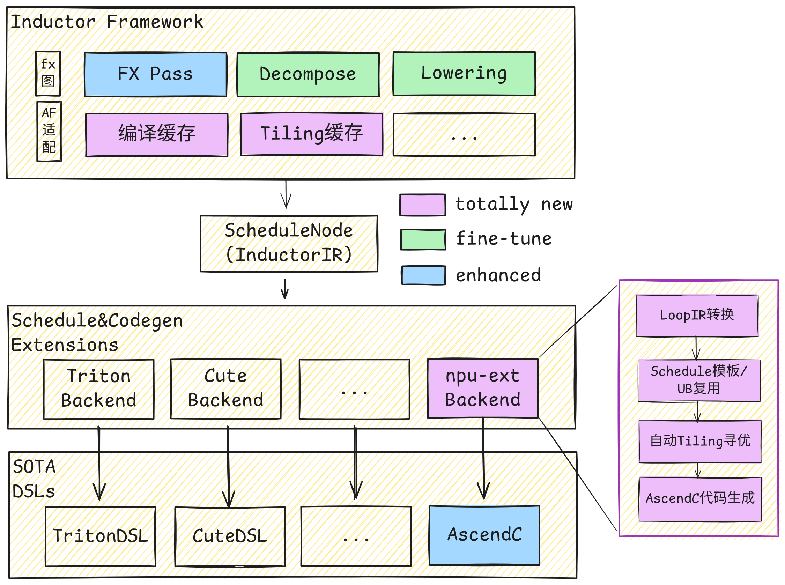
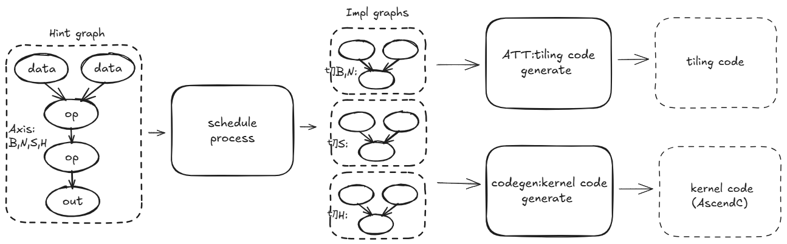
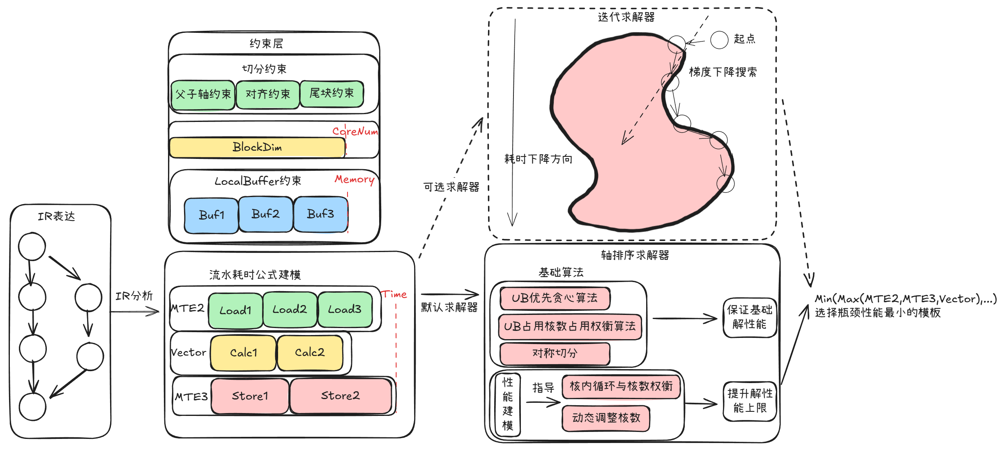
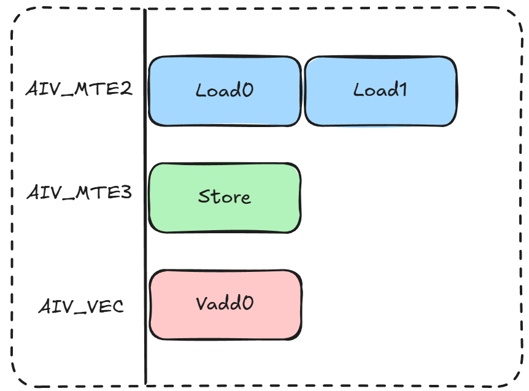
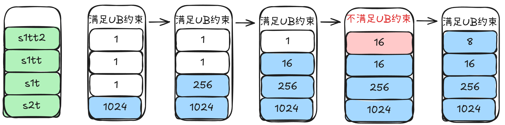
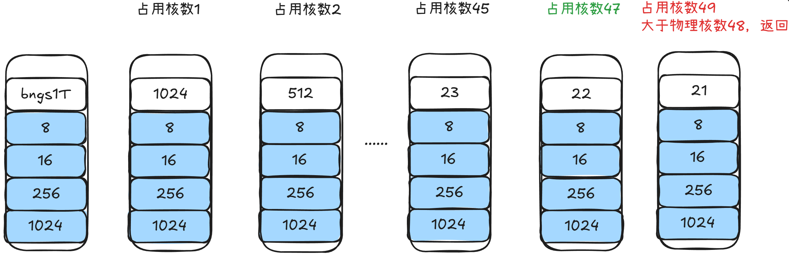

# NPU DeepSeek-V4 AutoFuse算子自动融合优化

随着AI模型结构日益复杂化，特别是MoE(混合专家)及多模态架构中，动态、细粒度的小算子组合已成为主流设计模式。DeepSeek本次发布的最新模型中，诸如hcPre、hcPost均是灵活小算子结构，未来在多模态场景类似结构也会成为常态。这类算子结构灵活多变，组合方式多样，若依赖传统手写融合算子方式进行优化，其开发效率已难以跟上模型快速迭代的需求。因此，实现对算子的自动化融合能力具有显著的技术必要性与紧迫性。

PyTorch框架在图模式下的Inductor组件为此提供了基础的算子融合与编译能力，其设计兼容现有PyTorch生态，具备良好的软件继承性。然而，由于NPU与GPU在内存架构、计算单元及并行机制等方面存在本质差异，直接沿用面向GPU的优化策略难以充分发挥NPU的硬件潜力。

为在继承Inductor整体流程与接口的基础上实现针对NPU的高效融合，需具备面向NPU的即时编译（JIT）算子生成能力。为此，CANN框架继承的AutoFuse组件针对NPU架构特征进行了深度优化，实现了从计算图到高效NPU算子代码的自动化映射与生成。该组件不仅保持与Inductor技术的协同与兼容，更进一步通过架构感知的融合策略、内存访问优化与指令调度等手段，显著提升了算子融合在NPU上的执行效率，从而支撑复杂模型在NPU平台上的高性能部署。

在本篇技术报告中，我们将对NPU的vector算子自动融合技术以及与inductor的对接工作进行阐述，同时简单介绍模型收益与使能方式。

## Highlights

- 使用简单：PyTorch前端增加一行代码即可使能
- 性能提升：依赖NPU亲和的算子生成技术，提升模型开箱性能
  - 亲和NPU，模板规约的schedule技术
  - 基于硬件建模，动态求解的算子tiling技术
  - 基于AscendLoopIR表达的，AscendC算子kernel代码生成技术
- 泛化与完备度：当前已支持152个LoopIR中的46个，未来将逐步补齐，与LoopIR完整对等

## Outline

- [NPU DeepSeek-V4 AutoFuse算子自动融合优化](#npu-deepseek-v4-autofuse算子自动融合优化)
  - [Highlights](#highlights)
  - [Outline](#outline)
  - [inductor与AutoFuse对接](#inductor与autofuse对接)
  - [AutoFuse JIT的算子生成能力](#autofuse-jit的算子生成能力)
    - [亲和NPU，模板规约的schedule技术](#亲和npu模板规约的schedule技术)
    - [基于硬件建模，动态求解的算子tiling技术](#基于硬件建模动态求解的算子tiling技术)
    - [基于AscendLoopIR表达的，AscendC算子kernel代码生成技术](#基于AscendLoopIR表达的ascendc算子kernel代码生成能力)
    - [AscendLoopIR简介](#AscendLoopIR简介)

## inductor与AutoFuse对接

我们扩展了inductor在NPU上的Codegen后端，通过将InductorLoopIR转换为AscendLoopIR，调用AutoFuse模块进行Schedule模板选择、UB复用与Tiling调优，生成高效的AscendC Kernel实现。



Inductor对接Autofuse的参考实现：[inductor_npu_ext](https://gitcode.com/Ascend/torchair/blob/master/experimental/_inductor_npu_ext/)

### 脚本使能方式

1. 在脚本开头导入 inductor_npu_ext 以注册基于 Autofuse 的 inductor 编译后端扩展。

```python
import inductor_npu_ext
```

2. 通过在函数上添加 @torch.compile 装饰以对函数进行编译，建议基于以下规则选择 inductor 编译范围：

- 编译范围内图结构稳定，不包含执行时分支选择、.item()内存同步等行为，避免过多的断图（Graph Break）。
- 避免编译范围过大，过大的编译范围由于 dynamo guard 叠加，更容易触发重新编译（re-compile）。
- 选择包含较多 Pintwise/Reduce 计算的范围进行编译，inductor 对该类计算的融合效果较好，能以较小的编译代价获取性能收益。

### 典型片段收益

在 DeepSeek-V4 模型中，hc_post 片段包含多个小算子组合，适合通过 AutoFuse 进行融合优化。通过 @torch.compile 装饰对 hc_post 函数进行编译，可以显著提升其执行性能。

```python
@torch.compile
def hc_post(x: torch.Tensor, residual: torch.Tensor, post: torch.Tensor, comb:torch.Tensor) -> torch.Tensor:
    y = post.unsqueeze(-1) * x.unsqueeze(-2) + torch.sum(comb.unsqueeze(-1) * residual.unsqueeze(-2), dim=2)
    return y.type_as(x)
```

> 性能数据在昇腾 A3 ，基于 hc_post 执行时的典型输入 shape 进行测试。

| 模型部分 | 未编译耗时 | 编译后耗时(dynamic=False) | 性能提升 | 编译后耗时(dynamic=True) | 性能提升 |
| -------- | ---------- | ------------------------- | -------- | ------------------------ | -------- |
| hc_post  | 30 us      | 7.5 us                    | 4x       | 10 us                    | 3x       |


## AutoFuse JIT的算子生成能力



算子的核心交付件主要包含kernel源码与tiling源码，AutoFuse模块将算子代码的生成过程抽象为几个阶段：

1. AscendLoopIR是抽象算子计算过程的表达IR，描述计算过程、切分轴、UB内存等信息；
2. schedule组件负责对Hint graph进行处理。根据实际硬件的能力，提供能够应对所有shape场景的，全量的轴切分策略。每一个具体的切分策略由一张称为impl graph的AscendLoopIR承载，组合成一组impl graphs作为后续ATT与codegen组件的输入；
3. ATT组件负责根据每个impl graph生成tiling代码，tiling代码在执行时会根据具体shape评估每个impl graph对应kernel模板的性能，选择最优模板，计算切分参数，通过tiling_data传递给kernel；
4. codegen组件负责根据每个impl graph生成kernel代码，每个impl graph对应一份模板实现，在执行时根据tiling_data参数决定实际要执行的模板，以及循环搬入的具体参数；

AutoFuse模块的源码已开源，[可在此获取](https://gitcode.com/cann/ge/tree/master/compiler/graph/optimize/autofuse)

### 亲和NPU，模板规约的schedule技术

在NPU上，硬件单元一次运行，可以完成批数据的向量运算，为了充分发挥硬件特点，需要准确选择进行向量运算的轴。同时面对硬件的多核能力以及内存有限的状态，还需要进一步选择进行分核切分的轴、进行UB切分的轴。这三种轴的正确选择对功能与执行性能都有巨大影响，选择错误就容易出现UB超载的功能问题或性能严重劣化的问题。

不同的输入shape规格通常亲和不同的切分策略，特定切分策略的算子实现我们通常称为模板。提供通用的模板可以简化问题复杂度，但无法提供更好的性能效果；提供精细、繁多的模板库，可以面对不同场景提供极致性能，但会让模板选择、代码维护变得困难。

AutoFuse作为JIT的算子融合技术，在模板设计上选择了折中的方案，提供多模板，但对适用场景做抽象规约，控制模板数量。通过有限的模板数，在绝大多数shape规格下都能提供优秀的性能。Schedule模块负责根据HintGraph产生一组ImplGraph，每个ImplGraph对应一个模板实现。

#### 以reduce多模板举例

Reduce融合是深度学习中最常见的场景之一，涉及Sum、Max、Min、Mean、Prod、Any、All等归约操作。其核心挑战在于：

- 归约轴与非归约轴的差异化处理
- 多核负载均衡
- 归约后的继续计算优化

为应对不同shape下的切分策略，归纳如下三类主要模板应对不同的适用场景。

| 模板类型              | 触发条件                      | 调度特点               | 适用场景             |
| --------------------- | ----------------------------- | ---------------------- | -------------------- |
| **全载模板**    | Reduce后节点≤4且为AR/ARA模式 | 不需要切分Reduce轴     | 小数据量、简单图结构 |
| **通用模板**    | 默认选择                      | UB切分+Block切分       | 中等规模、通用场景   |
| **R轴分核模板** | 数据规模大且可切分            | Reduce轴作为多核切分轴 | Reduce轴较大         |

在大R轴场景，若只设计通用模板，会导致UB超载的功能问题；在小数据场景选择通用模板，则又会因为核启动开销大而影响性能；

#### AutoSchedule实现介绍

AutoSchedule的核心思想是将融合图中的各种计算节点抽象为几大类ComputeType，根据每种类型在NPU上的特定切分方式，通过AxisGroup对轴进行语义分组，并利用Merge规则生成适用于所有节点的公共AxisGroup，最终生成多种切分候选方案（TilingCase）。

**ComputeType抽象与NPU切分方式**

将融合图中的各种计算节点抽象为几大类ComputeType，每种类型在NPU上有其特定的最优切分方式：

| ComputeType           | 典型算子         | NPU切分特点                | 轴分组特征             |
| --------------------- | ---------------- | -------------------------- | ---------------------- |
| **Elementwise** | Add, Mul, Relu等 | 可任意维度切分，支持向量化 | 全部归入Y组            |
| **Broadcast**   | 广播算子         | 需处理不同shape的对齐      | 计算轴归入Y组          |
| **Reduce**      | Sum, Max, Min等  | 归约轴需特殊处理           | 归约轴R组，非归约轴Y组 |
| **Concat**      | 拼接             | 拼接维度不能切分           | 非拼接轴归入Y组        |

**AxisGroup轴分组与Merge规则**

针对不同ComputeType的切分需求，定义了AxisGroup结构对轴进行语义分组：

- **X组**：需要完整数据的轴（如Concat拼接轴），切分后需保持数据完整性
- **Y组**：元算子计算轴（如Elementwise），可灵活进行UB切分
- **R组**：Reduce归约轴，采用专用的多核归约策略

由于融合图中可能包含多种ComputeType，通过Merge规则生成一个适用于所有节点的公共AxisGroup：

| 规则类型 | 合并条件      | 结果       | 说明                     |
| -------- | ------------- | ---------- | ------------------------ |
| Y+Y      | 两节点均为Y组 | 保持Y组    | 计算特性相同，可直接合并 |
| Y+R      | Y组遇到R组    | 升级为R组  | Reduce优先级更高         |
| Y+YR     | Y组遇到YR组   | 扩展为YR组 | 兼容归约和非归约计算     |

**TilingCase候选方案生成**

基于公共AxisGroup，生成多种切分候选方案（TilingCase）。每个TilingCase定义了一组具体的切分参数：

- **UB切分**：指定哪个轴进行UB缓冲区切分
- **Block切分**：指定哪个轴用于多核并行
- **Reduce特殊处理**：是否启用R轴切多核策略

**Schedule调度变换**

Schedule对每个TilingCase执行具体的调度变换，将抽象的切分方案转换为具体的调度操作：

| 变换类型                    | 说明           | 效果                     |
| --------------------------- | -------------- | ------------------------ |
| **TileSplit**         | UB级切分       | 将数据分块加载到UB缓冲区 |
| **BlockSplit**        | Block级切分    | 实现多核并行             |
| **ReduceBlockTiling** | Reduce专用切分 | 优化归约操作的多核执行   |
| **向量化**            | 识别可向量化轴 | 提升计算吞吐             |

### 基于硬件建模，动态求解的算子tiling技术

schedule技术在编译时给出了应对不同shape的规约模板集合，在执行时就需要有配套技术能够正确选择模板，输出核切分，UB切分结果。计算结果错误会直接导致UB越界错误或性能急剧劣化。

在AutoFuse组件，此工作由ATT(Auto tiling)技术来完成。通过预置的性能建模以及多样的求解策略，来保证泛化场景的功能正确性与普适性能，同时寻求求解准度与求解速度之间的平衡。

#### 自动Tiling的挑战

1. **性能评估的困难**：schedule输出的不同模板，在 `GM非连续性`、`UB非连续性`、`是否向量化宽度对齐`、`循环次数`、`计算瓶颈`和 `搬运瓶颈`等方面存在较大差异，因此在不同的融合场景和Shape下会表现出不同的性能优劣。这就要求自动Tiling能够准确地评估不同模板的执行性能。
2. **分核与分块的权衡**：增加分核数量会带来额外的 `核启动开销`（包括硬件开销和软件开销），而减少分核则会导致单核负荷过大。因此，如何合理权衡 `分核数`和 `分Tile块大小`成为我们面临的关键难题。

#### 自动Tiling核心功能

自动Tiling的目标是找到能够实现 `Kernel最佳执行性能`的Tiling策略，其核心功能包括：

1. **寻找最优切分结果**：为每个ImplGraph找到其最优切分结果，确定Kernel执行时需要使用的核数量、每次从GM搬运到UB的数据量、UB内的循环次数、每次UB内计算的数据量，以及每次从UB搬运到GM的次数；
2. **选出最优模板**：基于每个ImplGraph的最优切分方案，尽可能准确地评估其Kernel执行性能，从而 `选出最优模板`。

#### 自动Tiling核心流程

<p align="center">
  
</p>

Kernel的执行逻辑会在IR中表达。自动Tiling会根据IR图的表达提取关键信息，包括：

- **约束的符号化表达**:

  - **LocalBuffer占用约束**：自动Tiling求解时需确保每一级LocalBuffer的占用都在硬件允许的范围内。例如，Kernel申请的TQue/TBuf及临时Buf的大小之和不能超过硬件的UB大小限制。IR会表达出每个Tensor的location（是在GM还是UB上）以及Tensor间的复用关系，自动Tiling根据这些信息将各级LocalBuffer的约束进行符号化表达。
  - **核数占用约束**：自动Tiling会根据轴的切分方式生成实际核数的符号化表达，在Tiling运行时根据实际的硬件约束和确定的符号值判断是否满足约束。
  - **切分约束**：例如，保证子轴大小小于等于父轴的约束、切分轴需要32B对齐等。
- **各流水耗时符号化表达**

  - 自动Tiling会对各个API进行 `性能建模`，通过 `符号化`的形式表达这些API在各个流水线上的性能。根据IR表达的循环轴来确定API的调用次数，从而推导出该IR的所有API在各个流水线上的总耗时。此处假设瓶颈流水线的执行可以较好地掩盖非瓶颈流水线的执行（`瓶颈流水线简化理论`），因此任务执行的总耗时主要体现在瓶颈流水线的时间上。如下图所示，图中包含三个pipe流水，其中瓶颈流水为AIV_MTE2，AIV_MTE2在执行时会掩盖AIV_MTE3和AIV_VEC的执行，任务执行的总耗时体现在AIV_MTE2的执行耗时上。

  <p align="center">
    
    <br>
    <span style="color: #7f8c8d; font-size: 0.9em;">pipe流水示意图</span>
  </p>

自动Tiling根据提取的关键信息生成Tiling求解器代码，默认生成 `轴排序Tiling求解器`。该求解器会以"算子实现过程中的存储占用不超过NPU各级物理存储大小"为约束条件，根据不同的IR表达，选择最合适的Tiling算法，`保证基础解的性能`；再以"最小化瓶颈执行单元的耗时"为优化目标，通过性能建模进行求解，`提升解的性能上限`。

此外，系统还提供可选配置的 `启发式迭代求解器`。该求解器采用启发式求解方法，从初始解开始，在满足约束条件的可行域内，沿着性能公式建模的梯度下降方向搜索满足内存要求的解空间，直到公式建模的值达到最小值时退出寻优流程，并返回最优Tiling。

#### 关键技术

**性能公式建模**：

**定位**：性能公式的仿真精度决定了：

- 对Schedule生成的模板选择的准确性；
- 轴排序核数调整及核内循环选择的准确性；
- 启发式迭代求解的准确性。

因此，需要对各类API进行尽可能精确的性能建模。

**搬运类API建模实现**：

1. **识别影响搬运性能的主要因素**。

   - 例如：`数据量`、`GM非连续性`、`UB非连续性`、`是否向量化宽度对齐`、`分核数`、`Pipe头开销`、`API头开销`、`API调用次数`等。
2. **基于影响搬运性能的主要因素及其对性能的影响，设计性能公式**。

   - 例如，假设MTE2的开销为Cost(MTE2)，其中 `API头开销`为h，`数据量`为DataSize，`API调用次数`为Count，`Pipe头开销`为H，`带宽`为T：

     ```
     Cost(MTE2) = ((DataSize / T + h) * Count) + H
     ```

     其中 `带宽`是与 `是否向量化宽度对齐`、`分核数`、`GM非连续性`、`UB非连续性`相关的因变量。
3. **基于假设的性能模型，通过实验验证不同主因素变化下的实际搬运性能**。
4. **建立搬运性能与主因素之间的关系，并通过符号化技术表达出来**。

**计算类API建模实现**：

1. 针对AscendC的 `稳定基础API`，自动Tiling模块会根据不同的输入采集性能数据，得到 `性能与输入的关系`，并建立性能模型，通过符号化技术表达出来。
2. 针对调用AscendC的 `易变API`，自动Tiling模块会基于 `API调用的逻辑`，计算其 `调用入参`和 `调用次数`，生成该API的完整性能模型，从而得到相对准确的性能建模。

基于 `搬运类API建模`和 `计算类API建模`，以及 `瓶颈流水线`简化理论，可以将自动Tiling的两个核心问题简化为：

1. 如何调整Tiling使得瓶颈流水公式值最小；
2. 选择瓶颈流水公式值最小的模板作为最优模板。

**轴排序求解器**：

**定位**：
Tiling求解器的目标是基于输入Shape确定合适的分核及分块大小，以获得尽可能好的Kernel性能。轴排序求解器支持的启发式优先级排序规则（`优先`是指优先不切的轴）及基础算法（如 `UB占用核数占用权衡算法`、`UB优先贪心算法`、`对称切分`）可以很好地保证基础解的性能，另一方面结合性能建模的表达可以提升Kernel性能的上限。

**实现**：

- **确定切分轴的优先级**：首先需要基于API来确定切分轴的 `优先级`，顺序如下：

  - 父轴优先级高于子轴（功能性硬约束）；
  - 规约化类轴高于非规约化类轴（启发式规则）；
  - 广播轴高于非广播轴（启发式规则）；
  - 非最内轴高于最内轴（启发式规则）；
  - 搬运API的尾轴具有同等优先级（启发式规则）。
- **分核与核内切分**：其次分成两个部分进行切分，包括 `核内Tiling`和 `分核Tiling`。以 `UB优先贪心算法`为例（适合API头开销较大的场景）：

  - **核内Tiling**：按照轴排序的逆序依次遍历，优先将变量调整至最大值，判断是否符合硬件约束条件。若不满足，则通过二分法调整该变量，直到符合硬件约束条件为止，随后调整下一个核内Tiling变量，直至所有变量均满足硬件约束条件。例如，s1tt2、s1tt、s1t、s2t是Tiling相关轴，其切分流程如下：

    <p align="center">
      
    </p>
  - **分核Tiling**：识别与多核相关的变量，按从大到小的顺序遍历这些变量，找到核数占用更大的记录，若超出物理核数则返回。如下图所示，bngs1T是多核切分轴，其切分流程如下。选择策略为：当核数占用不同时，优先选择占用核数更大的记录。根据上述策略，最终选定的占用核数为47。

    <p align="center">
      
    </p>

    具体流程为：优先遍历s2t，调至最大值1024，符合硬件约束条件；然后遍历s1t，调至最大值256，符合硬件约束条件；然后依次调整下个变量s1tt>s1tt2，直到所有变量均满足硬件约束条件。
- **其他算法**：

  - `UB占用核数占用权衡算法`：适合需要精细控制核数占用及UB占用的场景（有预设值，可根据性能公式动态调整核数）。
  - `对称切分`：适合尾轴转置场景，需要保证作为搬运类API的多个尾轴可以按照同等优先级切分。

### 基于AscendLoopIR表达的，AscendC算子kernel代码生成能力

Codegen的功能是解析Schedule生成的impl_graph，生成融合算子的host_code和kernel_code，其中host_code包括tiling_func、infer_shape以及get_kernel代码，kernel_code包括kernel和tiling_data代码，最后完成代码的编译。

#### Codegen主要流程

Codegen的核心功能是生成在device侧执行的kernel代码，Codegen的输入是schedule生成的impl_graph，该图上承载了shape信息、节点信息、轴信息等生成代码的基本要素。impl_graph示例如下：


图上的具体信息如下所示：

```C++
Sizes:
  z0z1t_size: VAR
  z0z1Tb_size: VAR
Axis:
  z0(0) : 200, ORIGINAL, align: -1, allow_oversize_axis: 0, allow_unaligned_tail: 1  //轴信息
  z1(1) : 200, ORIGINAL, align: -1, allow_oversize_axis: 0, allow_unaligned_tail: 1
  z0z1(2) : 40000, ORIGINAL, align: -1, allow_oversize_axis: 0, allow_unaligned_tail: 1  //z0z1合轴后的信息
  z0z1T(3) : Ceiling((40000 / (z0z1t_size))), TILE_OUT, from: {z0z1, }, align: 1, allow_oversize_axis: 0, allow_unaligned_tail: 1  //z0z1T对应Tile切分的外轴, 对应所有核UB内for循环的总数量
  z0z1t(4) : z0z1t_size, TILE_IN, from: {z0z1, }, align: 1, allow_oversize_axis: 0, allow_unaligned_tail: 1  //z0z1T对应Tile切分的内轴，也就是每次AscendC api处理的数据量
  z0z1TB(5) : Ceiling((Ceiling((40000 / (z0z1t_size))) / (z0z1Tb_size))), BLOCK_OUT, from: {z0z1T, }, align: 1, allow_oversize_axis: 0, allow_unaligned_tail: 1  //z0z1TB对应Block切分的外轴，对应需要的核数
  z0z1Tb(6) : z0z1Tb_size, BLOCK_IN, from: {z0z1T, }, align: 1, allow_oversize_axis: 0, allow_unaligned_tail: 1  //z0z1T对应Tile切分的内轴，对应单个核UB内for循环的数量
Nodes:
......
  abs_test/load_0: Load (1)
......
  abs_test/abs_0: Abs (2)
    .axis = {z0z1TB, z0z1Tb, z0z1t, }  //Abs节点所有轴信息
    .loop_axis = z0z1Tb  //Abs节点循环轴的分界，该轴之前的轴都是循环轴，之后的轴是向量化轴，对应api一次处理的数据量
    .api:
      .compute_type = elewise  //计算类型
      .type = Compute
      .unit = Vector  //计算单元
    .x = abs_test/gather_0.y
    .y.dtype = float32  //数据类型
    .y.axis = {z0z1TB, z0z1Tb, z0z1t, }  //输出tensor的轴信息
    .y.repeats = {(40000 / (z0z1Tb_size * z0z1t_size)), z0z1Tb_size, z0z1t_size, }  //轴大小
    .y.strides = {(z0z1Tb_size * z0z1t_size), z0z1t_size, 1, }  //轴stride
    .y.vectorized_axis = {z0z1t, }  //向量化轴
    .y.vectorized_strides = {1, }  //向量化轴的stride
    .y.mem:
      .tensor_id = 3  //输出tensor的id
      .alloc_type = Queue  //分配类型，Queue表示在UB的TQueue中分配内存
      .hardware = UB  //硬件类型，UB表示在UB中分配内存
      .position = TPosition::VECOUT  //内存位置，VECOUT表示输出tensor的内存位置
    .y.que:
      .id = 1  //表示tensor对应的queue_id
      .depth = 2  //queue的深度
      .buf_num = 2  //queue中buffer的数量
      .reuse_id = 1  //表示queue是否可以复用，1表示可以复用
  abs_test/store: Store (3)
......
```

根据impl_graph解析，如下所示是Codegen生成DataCopy api的示例代码，可以看出核心流程是解析图上的切分策略，组装api的入参，生成在device侧执行的代码。

```C++
ss << "DataCopyPadExtend(" << ub << ", " << gm << "[" << gm_offset << " + " << tpipe.tiler.Size(api_attr.offset)
   << "], " << dma_param.block_count << ", " << dma_param.block_len << ", " << dma_param.src_stride << ", "
   << dma_param.dst_stride << ");" << std::endl;
```

与传统算子代码类似，针对不同的切分策略，schedule会生成多个模板，对应不同的impl_graph，Codegen需要依次解析，生成模板函数，在核函数入口的位置根据tiling_key调用不同的模板函数。示例如下：

```C++
extern "C" __global__ __aicore__ void abs_test(GM_ADDR abs_test_Data_0, GM_ADDR abs_test_Output_0, GM_ADDR workspace, AutofuseTilingData param) {
  const AutofuseTilingData t;
    if (TILING_KEY_IS(0)) {
      abs_test_0_general_0_nil_2_nil(abs_test_Data_0, abs_test_Output_0, workspace, t);
    } else if (TILING_KEY_IS(1)) {
      abs_test_0_general_0_nil_2_nil_unaligned(abs_test_Data_0, abs_test_Output_0, workspace, t);
    }
}
```

Codegen生成的kernel代码是以AscendC api为基础的。不同的模板函数，生成的for循环以及每次处理的数据量有所不同，示例如下：

**tiling_key=0**
对z1轴进行切分，每次在UB中完成计算的向量化轴为z1t。

```C++
for (int z0z1Tb = 0; z0z1Tb < z0z1Tb_loop_size; z0z1Tb++) {
    Abs(y_local[0], xlocal[0], z1t_actual_size);
}
```

**tiling_key=1**
对z0轴进行切分，每次在UB中完成计算的向量化轴为z0t以及z1。

```C++
for (int z0Tb = 0; z0Tb < z0Tb_loop_size; z0Tb++) {
    Abs(y_local[0], xlocal[0], z0t_actual_size * z1_axis_size);
}
```

总体而言，Codegen是依据impl_graph生成kernel代码的，但是要持续提升kernel代码性能，仍需要在Codegen框架优化和api内部优化两方面不断挖掘。

### AscendLoopIR简介

AutoFuse组件中的AscendLoopIR是一套基于Loop定义的IR，其类型(type)映射到的明确的vector计算，如：Add，Mul等。

多个AscendLoopIR组成的DAG图，称做AscGraph，表达算子多层循环中的多步计算。每一步计算对应途中的一个节点，节点则由AscendLoopIR实例化而来，节点之间的有向边表示数据的传递关系，每个节点还包含属性，用于指定该计算所处的循环层级。

在AscGraph中，节点通常嵌套在多层循环中，被循环多次执行。例如，假设Foo节点的调度信息与0号输出信息如下：

```C++
  Foo.sched.axis = [z0, z1, z2, z3];
  Foo.output[0].axis = [z0, z1, z2, z3];
  Foo.output[0].repeats = [s0, s1, s2, s3];
  Foo.output[0].stride = [s1 * s2 * s3, s2 * s3, s3, 1];
```

这意味着，Foo节点有四个相关轴z0, z1, z2, z3，每个轴对应的大小为s0, s1, s2, s3，根据stride可以判断是连续输出。Foo节点将在s0\*s1\*s2\*s3次迭代中被执行，等价如如下C++代码：

```C++
  for (uint64_t i0 = 0; i0 < s0; i0++) {
    for (uint64_t i1 = 0; i1 < s1; i1++) {
      for (uint64_t i2 = 0; i2 < s2; i2++) {
        for (uint64_t i3 = 0; i3 < s3; i3++) {
          // 执行Foo计算
        }
      }
    }
  }
```

上述代码，每个轴都展开成循环了，因此Foo在最内层做的就是一个scalar数的计算，如果把最内轴s3向量化，Foo上提一个循环，那么Foo每次进行的就是一次向量计算了。根据sched与output轴的灵活组合，就能够表达出广播
、规约、非连续搬运等各种复杂的计算形式；