# 融合算子mHC实现
论文链接：[https://arxiv.org/abs/2512.24880](https://arxiv.org/abs/2512.24880)

针对论文中的mHC结构，本次发布两个全新的融合算子：`HcPre`和`HcPost`，分别处理mHC前后处理的计算，如下图所示的融合范围：

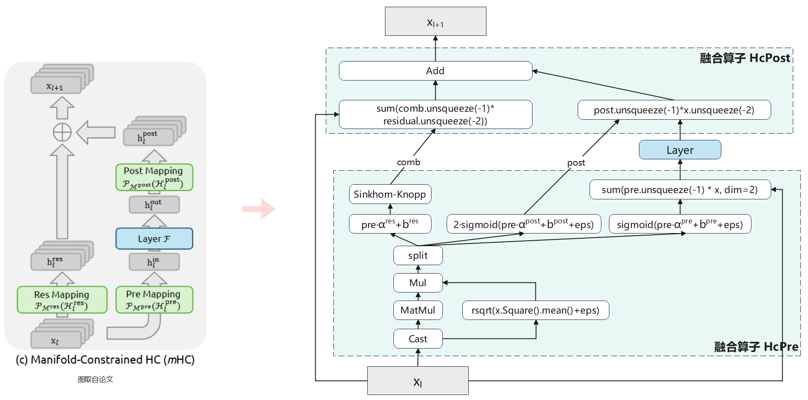

将整个HcPre融合为一个大算子，可以做极致的性能优化，同时通过一个接口暴露给脚本，调用简单，极致优化的产生的中间过程输出，脚本侧不感知。

将HcPost融合为一个大算子，消除小算子下的内存墙问题。

附：

A3为分离架构： Cube 核与 Vector 核数比为 1:2，每1个 Cube 核与2个 Vector 核构成一个组核一个AICore，其中一个组核的结构如下图所示，其中 L1、L0A、L0B、L0C 为 Cube 核的片上 Buffer，UB 为 Vector 核的片上 Buffer。具体介绍可参考：[基本架构](https://www.hiascend.com/document/detail/zh/canncommercial/82RC1/opdevg/Ascendcopdevg/atlas_ascendc_10_0008.html#ZH-CN_TOPIC_0000002336176974__section349312501823)。

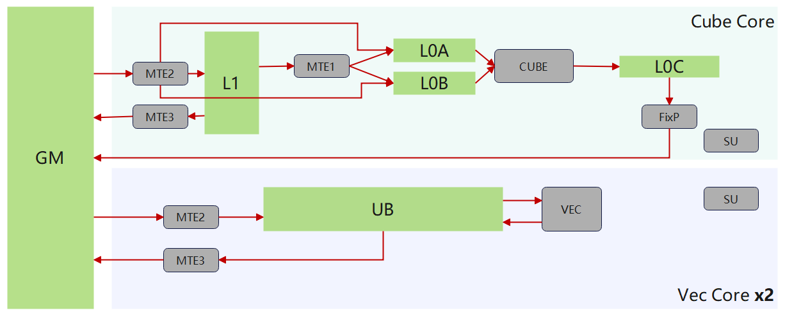

## Highlight

* 融合消除内存墙

* CV流水并行

* 极致的Tiling与流水

## Outline

[HcPre融合算子实现](##HcPre融合算子实现)

[HcPost融合算子实现](##HcPost融合算子实现)

## HcPre融合算子实现

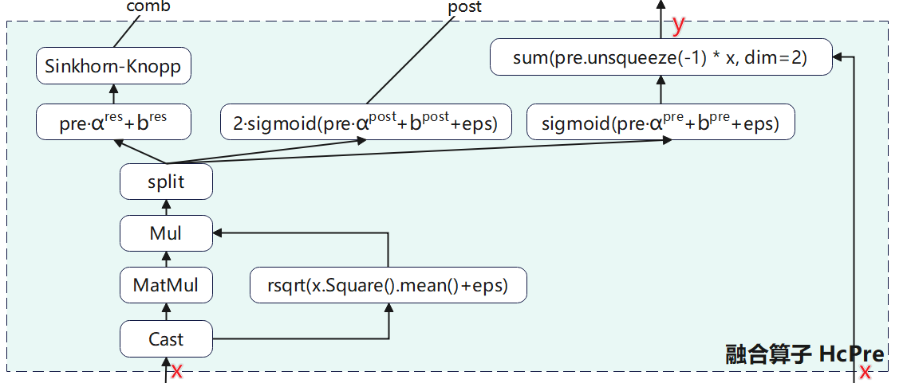

### A3实现设计

A3为分离架构，CV之间的数据交换需要借助hbm（workspace）进行交换。根据不同shape上Tiling差异在A3上实现两个模板: Decode场景模板（多核切K模板）和Prefill场景模板。

#### Decode场景实现设计

在decode场景中，由于m较小，需要在K轴上做多核切分以提升性能。

##### 整体计算流与Buffer使用设计：

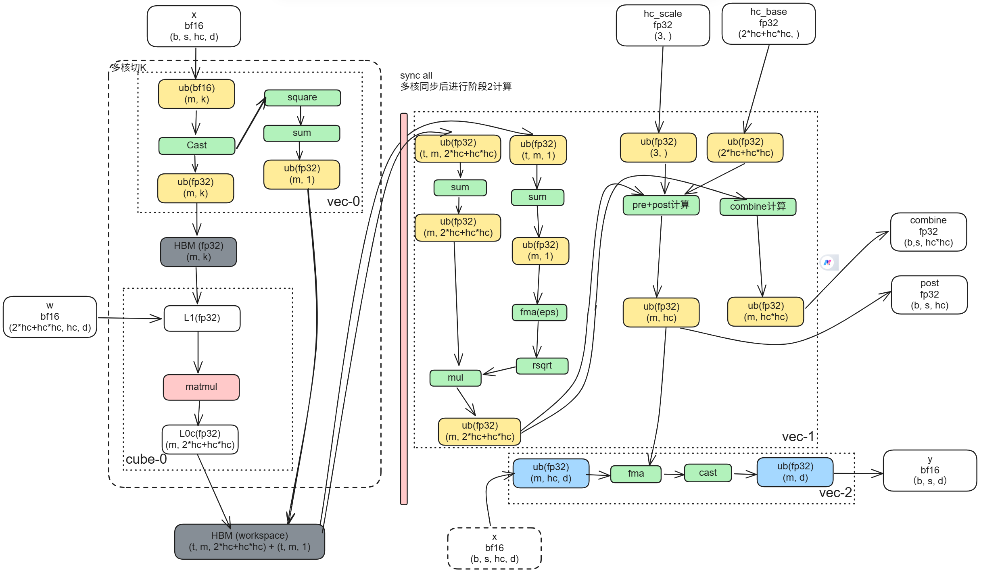

##### Tiling与流水设计：

**阶段一流水设计:**

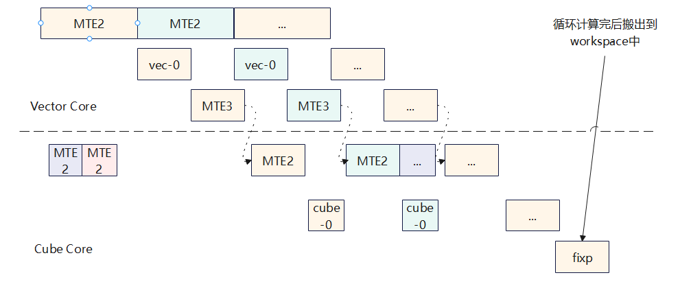

搬运\->类型转换\->cube计算形成，CV流水，中间内存较小，基本L2命中，提升流水效率。

**阶段二流水设计：**

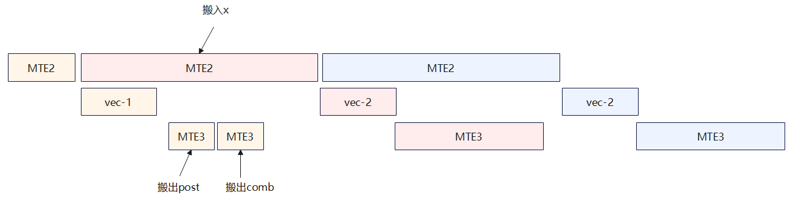

提前搬运x，掩盖pre、post和combine的vector计算开销。

##### 性能测试结果：

| 规格大小              | 性能（us） |
| --------------------- | ---------- |
| b*s=16; hc=4; d=4096  |  32.8      |
| b*s=32; hc=4; d=4096  |  37        |
| b*s=64; hc=4; d=4096  |  44        |
| b*s=128; hc=4; d=4096 |  60        |

#### Prefill场景实现设计

在Prefill场景上，根据token进行分核，形成CV流水。

##### 整体计算流与Buffer使用设计

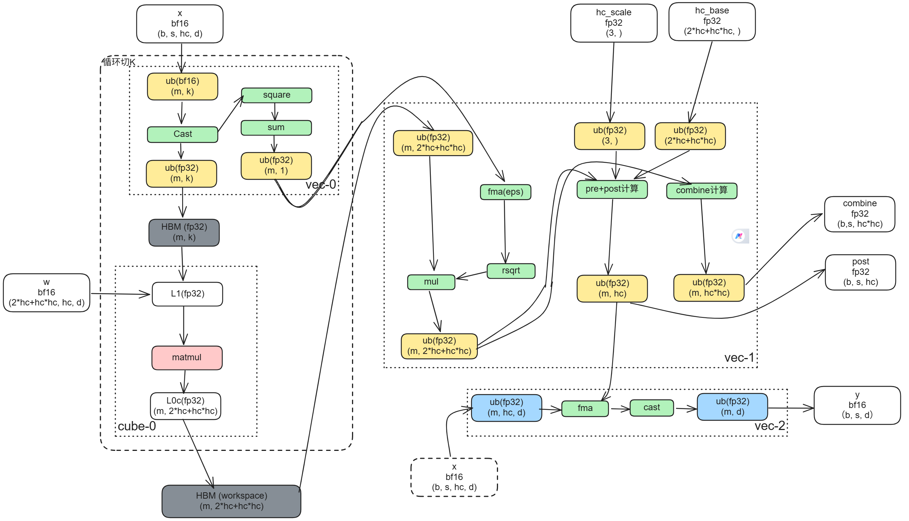

##### **Tiling与流水设计：**

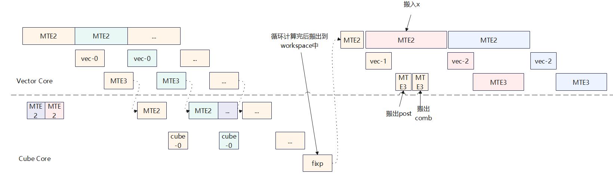

对于第一阶段流水执行，一阶段和二计算串行。（后续进一步优化可以选择两个V核分别一个做一阶段的vector计算，一个做二阶段的计算，流水执行，进一步掩盖开销。）

##### 性能测试结果：

| 规格大小              | 性能（us） |
| --------------------- | ---------- |
| b*s=4K; hc=4; d=4096  |  1254.916  |
| b*s=16K; hc=4; d=4096 |  4784.204  |
| b*s=64K; hc=4; d=4096 |  18545.39  |

## HcPost融合算子实现

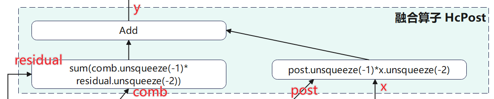

post在小算子下瓶颈在于内存墙，通过融合，数据不出UBuffer（核内buffer）减少hbm访存，极大的提升性能。

### A3实现设计

#### **整体计算流与buffer使用设计：**

在A3上，Vector中间计算结果在UBuffer上。

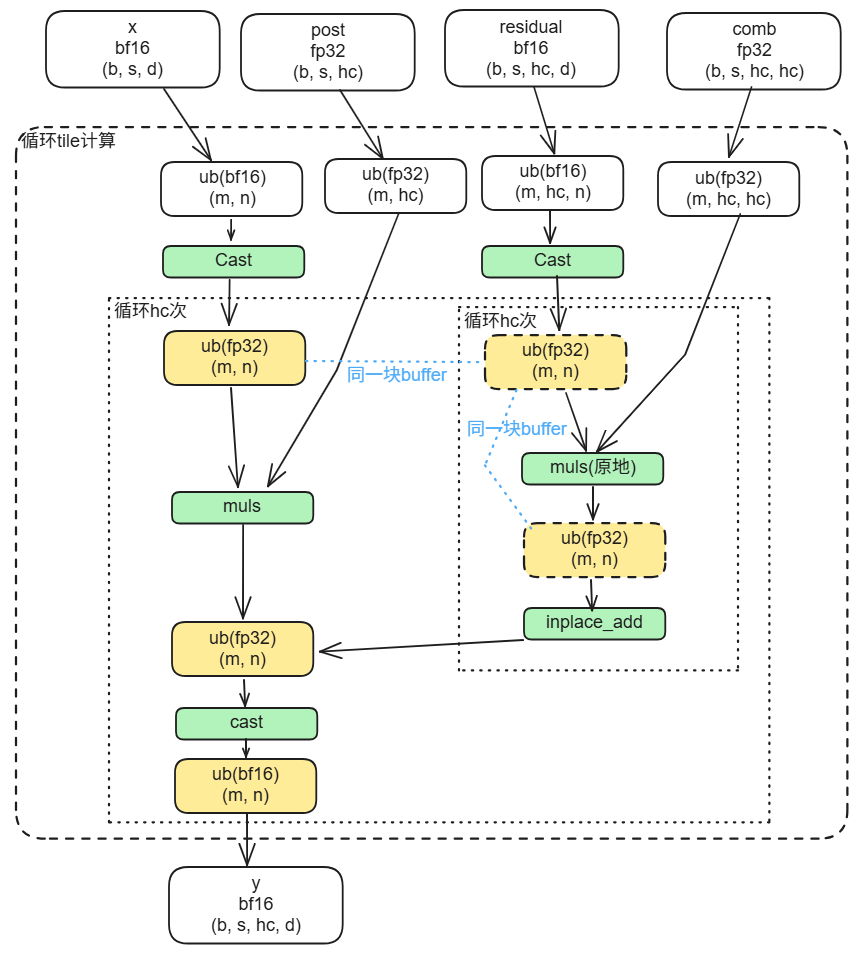

#### **Tiling与流水设计**

在b,s以及d轴上进行分核，b，s合并为一个轴bs，在bs, d上的tile块划分，每次计算tile块大小为\(m, n\)。极小case多核切分时，在开多核后的启动开销与处理开销上进行权衡，每个核最低搬运数据量诉求为4KB，n长度数据量不小于1KB并且512B对齐。

权衡buffer占用与流水掩盖，决定是否在hc轴上进行循环搬运流水，分为下面几种场景考虑模板：

1）针对hc比较小的case，可以一次性将residual的tile块（m, hc, n）都搬运进来。（如“HcPost计算步骤示意图”所示）

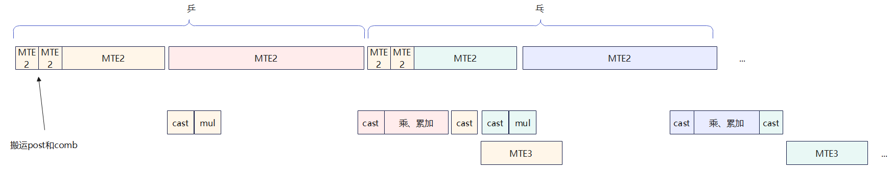

2）针对hc泛化case，考虑到ub可能会不够用，在residual的hc上开循环进行流水，每次搬运进来t个：

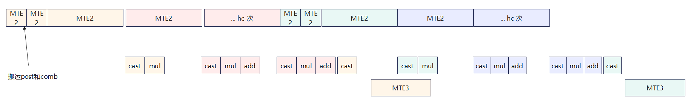

  计算步骤示意图下图：

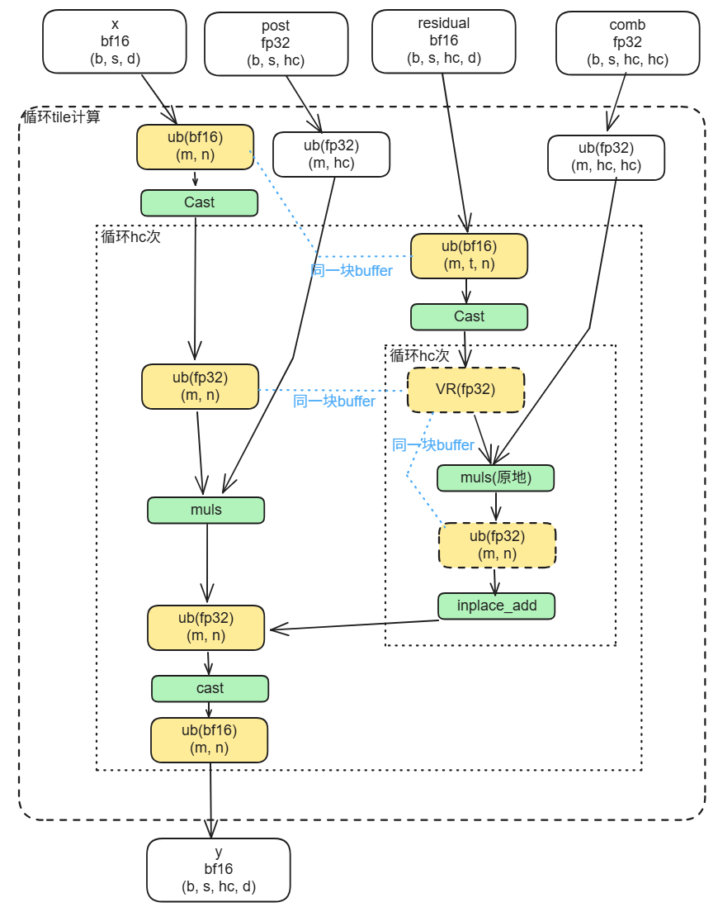

#### 性能测试结果：

| 规格大小                | 性能（us） |
| ----------------------- | ---------- |
| b*s=8; hc=4; d=4096     |   5.09     |
| b*s=16; hc=4; d=4096    |   5.37     |
| b*s=32; hc=4; d=4096    |   6.99     |
| b*s=64; hc=4; d=4096    |   9.16     |
| b*s=128; hc=4; d=4096   |   13.85    |
| b*s = 4K; hc=4; d=4096  |   319.86   |
| b*s = 16K; hc=4; d=4096 |   1264.68  |
| b*s = 64K; hc=4; d=4096 |   5044.53  |

