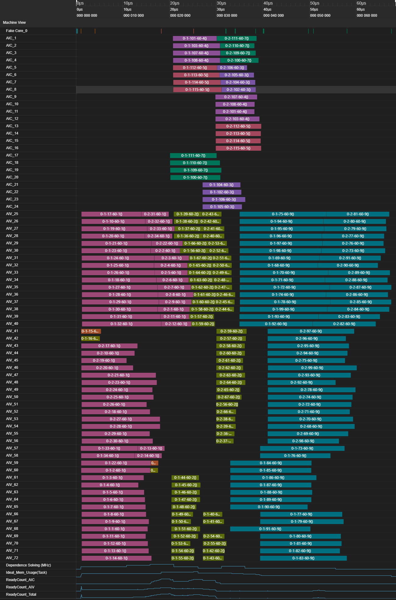
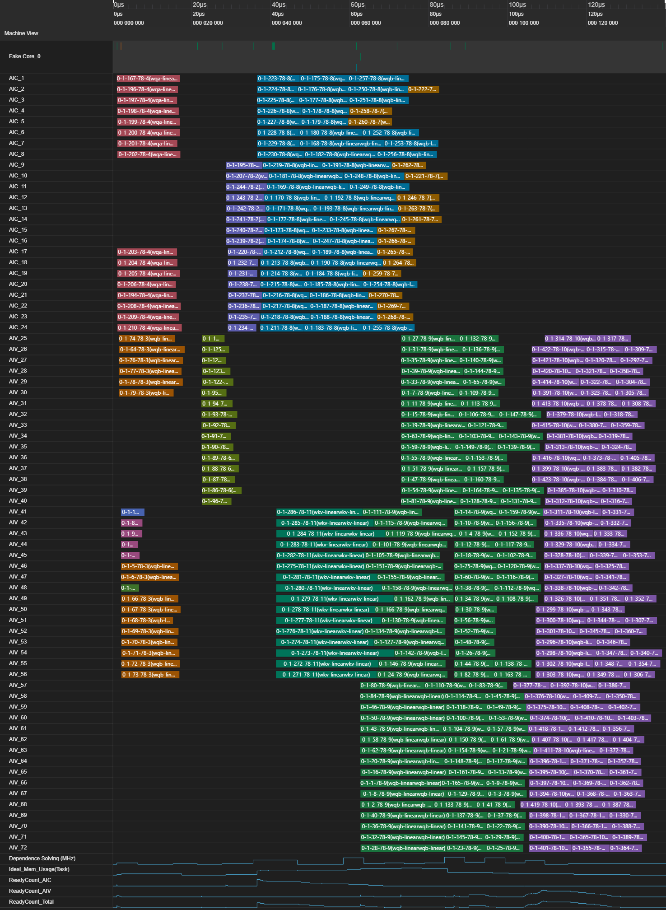
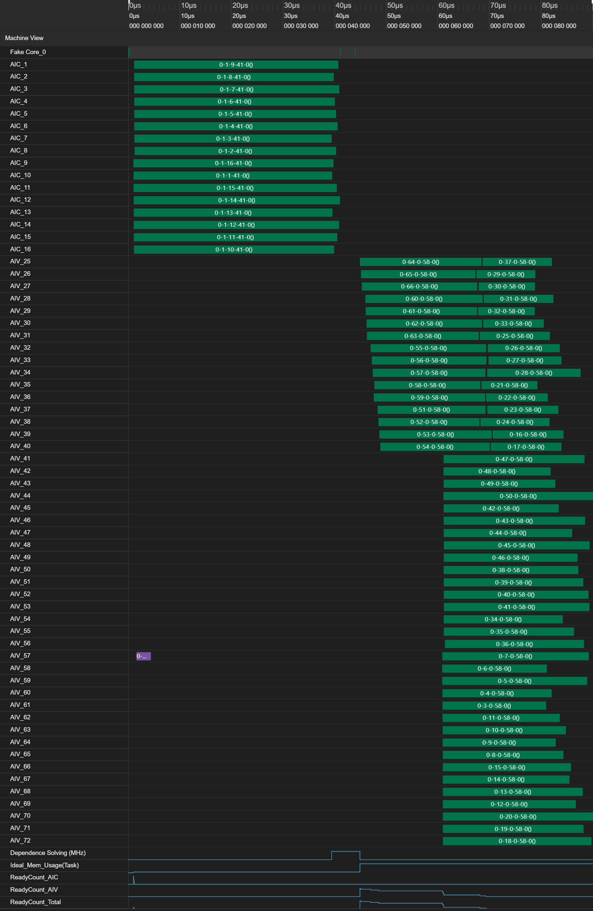
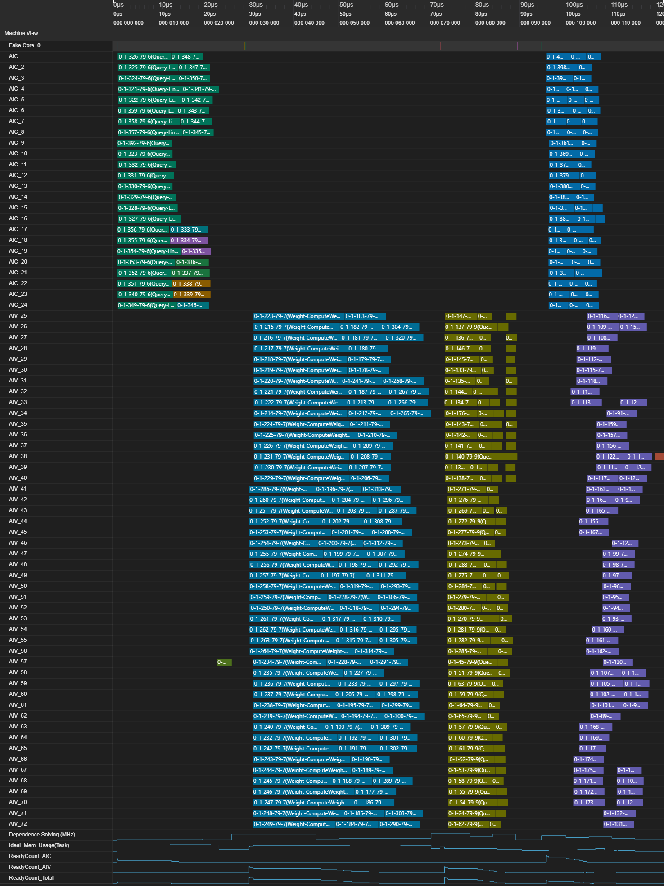
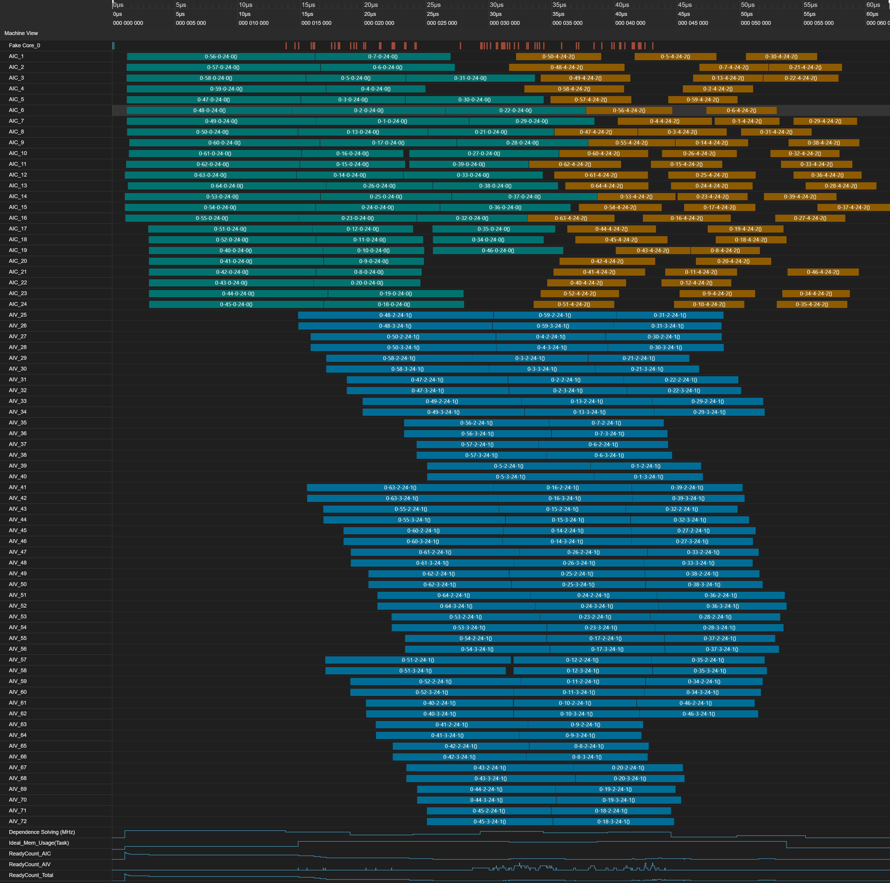
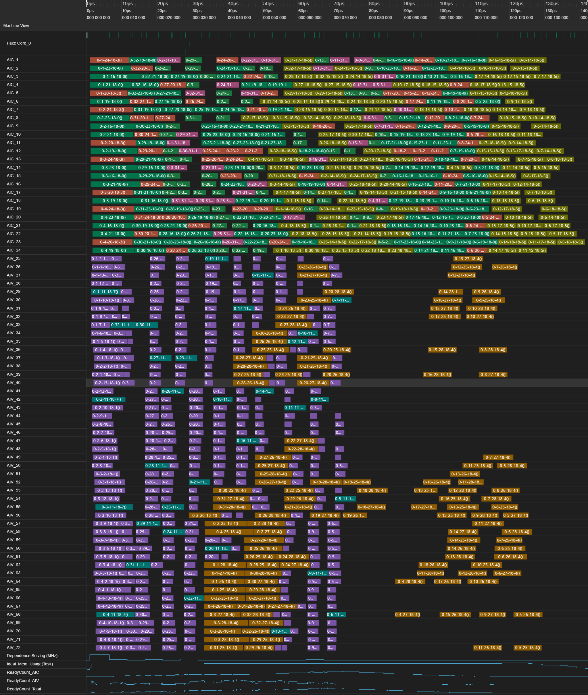
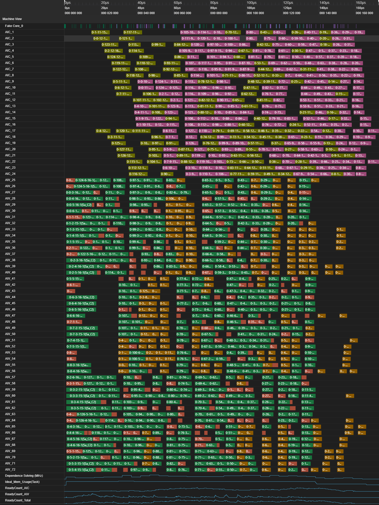

# NPU DeepSeek-V4模型 PyPTO 融合算子优化

面向 DeepSeek-V4架构，本次发布多个全新的融合算子：`hc_pre` ，`Compressor` 和三个 FA 类算子：`SWA`, `CFA`和`SCFA`；`MlaProlog` 和 `IndexerProlog` 也针对新架构进行了适配。其中`hc_pre`是本次 DeepSeek 新架构中 `Manifold-Constrained Hyper-Connections` (mHC) 的一部分。

本篇技术报告中，我们将对这些融合算子在 PyPTO 上的具体的实现和优化进行概述。同时，我们也会介绍 PTO-ISA（PTO 虚拟指令集）帮助 PyPTO 实现跨代际兼容。若对 PyPTO 高性能编程框架代码感兴趣，可参考 PyPTO 仓库：[Cann-PyPTO](https://gitcode.com/cann/pypto)。

以下是单 die 64 batch, MTP1，序列长度 8k 下各算子的实测性能数据以及各算子的代码规模，可以看出 PyPTO 可以以较少的代码量，高效的开发效率（3-7天）完成复杂融合算子的开发，且能取得不错的基础性能：

<table style="width:99%; border-collapse:collapse; margin:20px 0;">
    <tr>
        <th style="border:1px solid #ddd; padding:10px; text-align:center;">算子</th>
        <th style="border:1px solid #ddd; padding:10px; text-align:center;">代码行数(KLOC)</th>
        <th style="border:1px solid #ddd; padding:10px; text-align:center;">B</th>
        <th style="border:1px solid #ddd; padding:10px; text-align:center;">S1</th>
        <th style="border:1px solid #ddd; padding:10px; text-align:center;">S2</th>
        <th style="border:1px solid #ddd; padding:10px; text-align:center;">D</th>
        <th style="border:1px solid #ddd; padding:10px; text-align:center;">cmp_ratio</th>
        <th style="border:1px solid #ddd; padding:10px; text-align:center;">coff</th>
        <th style="border:1px solid #ddd; padding:10px; text-align:center;">start pos</th>
        <th style="border:1px solid #ddd; padding:10px; text-align:center;">Duration(us)</th>
    </tr>
    <tr>
        <td style="border:1px solid #ddd; padding:10px; text-align:center;">sliding_window_attention</td>
        <td style="border:1px solid #ddd; padding:10px; text-align:center;">0.3</td>
        <td style="border:1px solid #ddd; padding:10px; text-align:center;">64</td>
        <td style="border:1px solid #ddd; padding:10px; text-align:center;">2</td>
        <td style="border:1px solid #ddd; padding:10px; text-align:center;">8192</td>
        <td style="border:1px solid #ddd; padding:10px; text-align:center;">512</td>
        <td style="border:1px solid #ddd; padding:10px; text-align:center;">N/A</td>
        <td style="border:1px solid #ddd; padding:10px; text-align:center;">N/A</td>
        <td style="border:1px solid #ddd; padding:10px; text-align:center;">N/A</td>
        <td style="border:1px solid #ddd; padding:10px; text-align:center;">65</td>
    </tr>
    <tr>
        <td style="border:1px solid #ddd; padding:10px; text-align:center;">compressed_flash_attention</td>
        <td style="border:1px solid #ddd; padding:10px; text-align:center;">0.2</td>
        <td style="border:1px solid #ddd; padding:10px; text-align:center;">64</td>
        <td style="border:1px solid #ddd; padding:10px; text-align:center;">2</td>
        <td style="border:1px solid #ddd; padding:10px; text-align:center;">8192</td>
        <td style="border:1px solid #ddd; padding:10px; text-align:center;">512</td>
        <td style="border:1px solid #ddd; padding:10px; text-align:center;">128</td>
        <td style="border:1px solid #ddd; padding:10px; text-align:center;">N/A</td>
        <td style="border:1px solid #ddd; padding:10px; text-align:center;">N/A</td>
        <td style="border:1px solid #ddd; padding:10px; text-align:center;">90</td>
    </tr>
    <tr>
        <td style="border:1px solid #ddd; padding:10px; text-align:center;">sparse_compressed_flash_attention</td>
        <td style="border:1px solid #ddd; padding:10px; text-align:center;">0.2</td>
        <td style="border:1px solid #ddd; padding:10px; text-align:center;">64</td>
        <td style="border:1px solid #ddd; padding:10px; text-align:center;">2</td>
        <td style="border:1px solid #ddd; padding:10px; text-align:center;">8192</td>
        <td style="border:1px solid #ddd; padding:10px; text-align:center;">512</td>
        <td style="border:1px solid #ddd; padding:10px; text-align:center;">4</td>
        <td style="border:1px solid #ddd; padding:10px; text-align:center;">N/A</td>
        <td style="border:1px solid #ddd; padding:10px; text-align:center;">N/A</td>
        <td style="border:1px solid #ddd; padding:10px; text-align:center;">160</td>
    </tr>
    <tr>
        <td style="border:1px solid #ddd; padding:10px; text-align:center;">compressor_c4li</td>
        <td rowspan="6" style="border:1px solid #ddd; padding:10px; text-align:center;">0.9</td>
        <td style="border:1px solid #ddd; padding:10px; text-align:center;">64</td>
        <td style="border:1px solid #ddd; padding:10px; text-align:center;">2</td>
        <td style="border:1px solid #ddd; padding:10px; text-align:center;">N/A</td>
        <td style="border:1px solid #ddd; padding:10px; text-align:center;">128</td>
        <td style="border:1px solid #ddd; padding:10px; text-align:center;">4</td>
        <td style="border:1px solid #ddd; padding:10px; text-align:center;">2</td>
        <td style="border:1px solid #ddd; padding:10px; text-align:center;">8192</td>
        <td style="border:1px solid #ddd; padding:10px; text-align:center;">55</td>
    </tr>
    <tr>
        <td style="border:1px solid #ddd; padding:10px; text-align:center;">compressor_c4a</td>
        <td style="border:1px solid #ddd; padding:10px; text-align:center;">64</td>
        <td style="border:1px solid #ddd; padding:10px; text-align:center;">2</td>
        <td style="border:1px solid #ddd; padding:10px; text-align:center;">N/A</td>
        <td style="border:1px solid #ddd; padding:10px; text-align:center;">512</td>
        <td style="border:1px solid #ddd; padding:10px; text-align:center;">4</td>
        <td style="border:1px solid #ddd; padding:10px; text-align:center;">2</td>
        <td style="border:1px solid #ddd; padding:10px; text-align:center;">8192</td>
        <td style="border:1px solid #ddd; padding:10px; text-align:center;">80</td>
    </tr>
    <tr>
        <td style="border:1px solid #ddd; padding:10px; text-align:center;">compressor_c128a</td>
        <td style="border:1px solid #ddd; padding:10px; text-align:center;">64</td>
        <td style="border:1px solid #ddd; padding:10px; text-align:center;">2</td>
        <td style="border:1px solid #ddd; padding:10px; text-align:center;">N/A</td>
        <td style="border:1px solid #ddd; padding:10px; text-align:center;">512</td>
        <td style="border:1px solid #ddd; padding:10px; text-align:center;">128</td>
        <td style="border:1px solid #ddd; padding:10px; text-align:center;">1</td>
        <td style="border:1px solid #ddd; padding:10px; text-align:center;">8192</td>
        <td style="border:1px solid #ddd; padding:10px; text-align:center;">55</td>
    </tr>
    <tr>
        <td style="border:1px solid #ddd; padding:10px; text-align:center;">compressor_c4li</td>
        <td style="border:1px solid #ddd; padding:10px; text-align:center;">64</td>
        <td style="border:1px solid #ddd; padding:10px; text-align:center;">2</td>
        <td style="border:1px solid #ddd; padding:10px; text-align:center;">N/A</td>
        <td style="border:1px solid #ddd; padding:10px; text-align:center;">128</td>
        <td style="border:1px solid #ddd; padding:10px; text-align:center;">4</td>
        <td style="border:1px solid #ddd; padding:10px; text-align:center;">2</td>
        <td style="border:1px solid #ddd; padding:10px; text-align:center;">8191</td>
        <td style="border:1px solid #ddd; padding:10px; text-align:center;">75</td>
    </tr>
    <tr>
        <td style="border:1px solid #ddd; padding:10px; text-align:center;">compressor_c4a</td>
        <td style="border:1px solid #ddd; padding:10px; text-align:center;">64</td>
        <td style="border:1px solid #ddd; padding:10px; text-align:center;">2</td>
        <td style="border:1px solid #ddd; padding:10px; text-align:center;">N/A</td>
        <td style="border:1px solid #ddd; padding:10px; text-align:center;">512</td>
        <td style="border:1px solid #ddd; padding:10px; text-align:center;">4</td>
        <td style="border:1px solid #ddd; padding:10px; text-align:center;">2</td>
        <td style="border:1px solid #ddd; padding:10px; text-align:center;">8191</td>
        <td style="border:1px solid #ddd; padding:10px; text-align:center;">95</td>
    </tr>
    <tr>
        <td style="border:1px solid #ddd; padding:10px; text-align:center;">compressor_c128a</td>
        <td style="border:1px solid #ddd; padding:10px; text-align:center;">64</td>
        <td style="border:1px solid #ddd; padding:10px; text-align:center;">2</td>
        <td style="border:1px solid #ddd; padding:10px; text-align:center;">N/A</td>
        <td style="border:1px solid #ddd; padding:10px; text-align:center;">512</td>
        <td style="border:1px solid #ddd; padding:10px; text-align:center;">128</td>
        <td style="border:1px solid #ddd; padding:10px; text-align:center;">1</td>
        <td style="border:1px solid #ddd; padding:10px; text-align:center;">8191</td>
        <td style="border:1px solid #ddd; padding:10px; text-align:center;">125</td>
    </tr>
    <tr>
        <td style="border:1px solid #ddd; padding:10px; text-align:center;">mla_prolog</td>
        <td style="border:1px solid #ddd; padding:10px; text-align:center;">0.5</td>
        <td style="border:1px solid #ddd; padding:10px; text-align:center;">64</td>
        <td style="border:1px solid #ddd; padding:10px; text-align:center;">2</td>
        <td style="border:1px solid #ddd; padding:10px; text-align:center;">N/A</td>
        <td style="border:1px solid #ddd; padding:10px; text-align:center;">N/A</td>
        <td style="border:1px solid #ddd; padding:10px; text-align:center;">N/A</td>
        <td style="border:1px solid #ddd; padding:10px; text-align:center;">N/A</td>
        <td style="border:1px solid #ddd; padding:10px; text-align:center;">N/A</td>
        <td style="border:1px solid #ddd; padding:10px; text-align:center;">130</td>
    </tr>
    <tr>
        <td style="border:1px solid #ddd; padding:10px; text-align:center;">hc_pre</td>
        <td style="border:1px solid #ddd; padding:10px; text-align:center;">0.4</td>
        <td style="border:1px solid #ddd; padding:10px; text-align:center;">64</td>
        <td style="border:1px solid #ddd; padding:10px; text-align:center;">2</td>
        <td style="border:1px solid #ddd; padding:10px; text-align:center;">N/A</td>
        <td style="border:1px solid #ddd; padding:10px; text-align:center;">N/A</td>
        <td style="border:1px solid #ddd; padding:10px; text-align:center;">N/A</td>
        <td style="border:1px solid #ddd; padding:10px; text-align:center;">N/A</td>
        <td style="border:1px solid #ddd; padding:10px; text-align:center;">N/A</td>
        <td style="border:1px solid #ddd; padding:10px; text-align:center;">70</td>
    </tr>
    <tr>
        <td style="border:1px solid #ddd; padding:10px; text-align:center;">lightning_indexer_prolog</td>
        <td style="border:1px solid #ddd; padding:10px; text-align:center;">0.3</td>
        <td style="border:1px solid #ddd; padding:10px; text-align:center;">64</td>
        <td style="border:1px solid #ddd; padding:10px; text-align:center;">2</td>
        <td style="border:1px solid #ddd; padding:10px; text-align:center;">N/A</td>
        <td style="border:1px solid #ddd; padding:10px; text-align:center;">N/A</td>
        <td style="border:1px solid #ddd; padding:10px; text-align:center;">N/A</td>
        <td style="border:1px solid #ddd; padding:10px; text-align:center;">N/A</td>
        <td style="border:1px solid #ddd; padding:10px; text-align:center;">N/A</td>
        <td style="border:1px solid #ddd; padding:10px; text-align:center;">101</td>
    </tr>
</table>


## hc_pre

`hc_pre` 在每层会调用两次，分别在 attention 和 ffn 的计算前。

### 计算过程

1. 计算 RMSNorm 的分母

$$
rsqrt = \sqrt{\frac{1}{\frac{1}{n}\sum_{i=1}^n x_i^2 + \epsilon}}
$$

2. 计算 mixes

$$
mixes = (x @ hc\_fn) \odot rsqrt
$$

3. Sinkhorn-Knopp 算法

$$
pre, post, comb = sinkhorn(mixes, hc\_scale, hc\_base, hc\_mult, hc\_sinkhorn\_iters)
$$

Sinkhorn-Knopp 算法每次迭代会进行逐行归一化，再做逐列归一化，hc_sinkhorn_iters 控制迭代次数。

4. 利用 pre 和 x 计算 y

$$
y = rowsum(pre \odot x)
$$

实际开发中需要充分利用昇腾硬件的特性以实现更好的性能，以下将详细介绍当前的解决方案及具体的实现方式。

### 流水并行

计算流程中第一步是 Vector 计算，而第二步中 $x @ hc\_fn$ 是矩阵乘的 Cube 计算，且两者无依赖关系。PyPTO 的框架支持了两个任务的同时执行，无需手动插入同步。

### 指令优化

在 Sinkhorn-Knopp 算法中，涉及到了大量的重复的归约串联逐元素乘除的计算，在逐元素计算中，通过 pass 优化和 PTO 指令，避免了显式地广播，实现了高性能的计算。

```
pypto.experimental.set_operation_config(combine_axis=True)

```

### MatMul优化

decode场景下，matmul计算的K轴很长（16K）而M\N轴较小，因此采用切K的方式，将数据切分到不同的核上以充分利用计算资源

```
pypto.set_cube_tile_shapes([16, 16], [512, 2*1024], [128, 128], \
						enable_multi_data_load=True, enable_split_k=True)
mm_res = pypto.matmul(x_fp32, hc_fn, pypto.DT_FP32, b_trans=True)

```

### 计算优化

Prefill 和 Decode 的最大区别，在 x 入参的的 0 轴大小上。Prefill 场景下，t 通常比较大；而在 Sinkhorn-Knopp 算法中，归约轴很小，为 hc_mult=4，且在行归约时为 -1 轴，列归约时为 -2 轴。此时，我们采用数学上等价计算的技巧，在第二步计算中，在矩阵乘中直接计算转置：

$$
hc\_fn^T @ x^T
$$

从而在进入 Sinkhorn-Knopp 算法中，t 会置于尾轴上，归约轴为 -2, -3 轴，这样能提高计算的效率。

### 泳道图

在单 die 64 batch, MTP1 的场景下，上板执行结果如下：

<p align="center">
  
  <center>hc_pre泳道图</center>
</p>

## MlaProlog

该算子是 Multi-Head Latent Attention 将 hidden states 处理为 query 和 kv 的计算操作。

### 计算过程

1. Query 的计算<br>
   包括两次采样和 RmsNorm（其中第二次 RmsNorm 权重恒为 1），最后对 -1 轴的后 rope\_dim 维度进行 inplace interleaved rope 计算：

$$
c^Q = RmsNorm(x @ wq\_a)
$$

$$
q = RmsNorm(c^Q @ wq\_b)
$$

$$
q[..., -rope\_dim:] = ROPE(q[..., -rope\_dim:])
$$

2. Kv 的计算<br>
   包括一次采样和 RmsNorm，最后对 -1 轴的后 rope\_dim 维度进行 inplace interleaved rope 计算：

$$
k = RmsNorm(x @ wkv)
$$

$$
k[..., -rope\_dim:] = ROPE(k[..., -rope\_dim:])
$$

### 流水并行

PyPTO 采用了 MPMD 的调度方式，在 Decode 场景下，像 `x@wq_a` 和 `x@wkv` 不会使用满所有的核，因此可以并行执行；同理，query 和 kv 后续的 RmsNorm，亦可并行执行；

### Unrollist 将动态展开为静态图

在 Prefill 和 Decode 场景中，t 的差异往往是巨大的。通常情况下，一套代码Tile 切分很难在不同场景下均达到较好的性能；但是通过对动态值 t 进行了多分档，以及 Tile 切分采用静态 tTile 的方法，达到了在不同场景下均实现较优性能的结果。

```
unroll_list = [128, 64, 32, 16, 1]
for tIdx, unrollLength in pypto.loop_unroll(0, t, 1, name="MLA_BS_LOOP", idx_name="bs_offset",
                                            unroll_list=unroll_list, ):
	...
```

### 合图优化

通过设置合图参数，可以将相同结构的子图合并，避免同一结构子图数过大、避免重复搬运，同时可以增大核内流水调度可能性，实现了较优的性能。

```
pass_options={
    "cube_nbuffer_mode": 1,
    "vec_nbuffer_mode": 2,
    "vec_nbuffer_setting": {-1: 2}
}
```

### MatMul优化

根据输入参与matmul计算的tensor的shape通过设置合适的tile_shape，将matmul的任务均衡地分配到各aic 核上。当k轴过大时，使能切k或者手动切k，减少了单个任务的搬运量。在shape较大的情况下，开启大包搬运，提高了带宽利用率。通过以上方式，提升了matmul任务的效率。

```
# x_tile.shape=[128, 4096], wkv_shape=[4096, 512]
pypto.set_cube_tile_shapes([tile_bs, tile_bs], [256, 512], [128, 128], enable_split_k=True, enable_multi_data_load=True)
kv = pypto.matmul(x_tile, wkv, pypto.DataType.DT_FP32)
```

### 泳道图

在单 die 64 batch, MTP1 的场景下，上板执行结果如下：

<p align="center">
  
  <center>mla_prolog泳道图</center>
</p>

## Compressor

新模型引入了 `Compressor` 模块，PyPTO 对此进行了实现。

### 计算过程

$$kv = X@W^{KV}$$
$$score = X@W^{Gate}+ape$$
使用kv和score对kv_state和score_state进行刷新。推理场景下，当start_pos+1为`compress_ratio`倍数时，按下面的计算生成压缩的kv：
$$kv=(kv\_state * score\_state.\text{softmax(dim=1)).sum(dim=1)}$$
$$kv=\text{ROPE}(\text{RMSNorm}(kv))$$
`rotate`=true时对kv进行Hadamard变换。

### 多场景的不同优化

`Compressor` 模块使用的参数，例如压缩比 `compress_ratio`，`rotate` 等配置，在各层之间有所不同。针对不同的场景配置，PyPTO 在同一个算子中根据不同的分支，在每个分支上进行各自的优化，从而在不同的使用场景下均能达到较为良好的性能。下面以`compress_ratio`=4，`rotate`=false时的场景为例介绍优化方法。

### MatMul优化

```
b = 64
b_loop = (bsz + b - 1) // b
for b_idx in pypto.loop(b_loop, name="LOOP_COMP_1", idx_name="b_idx"):
	x_view = pypto.view(x, [b*s1, h], [b_idx*b*s1, 0])
        ## Matmul
        pypto.set_cube_tile_shapes([128, 128], [256, 512], [128, 128], True)
        kv_t = pypto.matmul(x_view, wkv, pypto.DT_FP32, b_trans=True)
	score_t = pypto.matmul(x_view, wgate, pypto.DT_FP32, b_trans=True)
```

该场景下两个矩阵乘的左右矩阵shape为[batchsize*s1, 4096], [4096, 1024]。batchsize是动态的。

1. 如果直接对batch进行循环展开，静态图中矩阵乘的M轴shape将为s1，导致整个算子中右矩阵被重复搬运多次，性能较差。因此，在动态的batch轴，我们使用b=64进行切分。
2. K轴使能大包搬运：cube_tile_shapes([128, 128], [256, 512], [128, 128], True)代表K轴的L0和L1搬运的tilesize分别设置为256, 512。通过一次搬运较大的数据量进入L1，来提升带宽使用率。

### 向量操作优化

```
b_valid = (bsz-b_idx*b).min(b)
for c_idx in pypto.loop(b_valid, name="LOOP_COMP_2", idx_name="c_idx"):
            pypto.set_pass_options(pg_skip_partition=True)
```

由于不同batch的start_pos不同，它们的vector处理可能进入不同的分支。不同batch所更新的kv_state和score_state的地址也不同。因此，我们对batch进行loop，对每个batch分别进行vector处理。我们通过设置''pg_skip_partition=True''，让一个batch的vector处理都在一个子图内。这是因为

1. 断图时中间数据会在GM和UB之间搬入搬出，造成性能劣化。
2. vector处理包括Softmax+ReduceSum和RMSNorm+RoPE，前者在1轴上进行操作，后者在尾轴上进行操作，难以较好地进行多核并行。在高吞吐的大batchsize场景时，由于batch间是独立的操作，因此每个batch作为一个子图，可以多核并行达成较好的性能。

```
index = cache_index[:,pos:pos+1]
kv_state = scatter_update_3d(kv_state, index, kv) ## b,4,2d
score_state = scatter_update_3d(score_state, index, score)
```

对后续vector操作使用的kv_state和score_state更新时，使用scatter_update这一OP，可以避免将kv_state和score_state多次搬入UB以及concat操作导致的性能劣化。

### 泳道图

在单 die 64 batch，MTP=1，并且每个batch都存在压缩操作的场景中，上板结果如下：

<p align="center">
  
  <center>compressor泳道图</center>
</p>

## IndexerProlog

和 DeepSeekV3.2 不同的是，IndexerProlog 只会出现在 compress_ratio = 4 的层，为后续 LightningIndexer 计算提供输入q、weight 及 q_scale。

### 计算过程

1. Query 的计算
   q, q_scale的计算公式如下：

$$
q\_tmp = \text{qr}@{idx\_wq\_b} \cdot \text{qr\_scale} \cdot \text{idx\_wq\_b\_scale}
$$

$$
q\_hadamard = \text{Cat}(\{q\_tmp[:, :nope\_dim], Rope(q\_tmp[:, nope\_dim:])\}, -1)@hadamard
$$

$$
q, q\_scale = Quant(q\_hadamard)
$$

其中，Rope表示旋转位置编码计算，Quant表示量化计算。

2. Weights 的计算
   Weights的计算公式如下

$$
weights = x@\text{weights\_proj} \cdot {\frac{1}{\sqrt{\text{idx\_nq} \cdot \text{head\_dim}}}}
$$

### 泳道图

在单 die 64 batch，MTP=1 的场景下，上板结果如下：

<p align="center">
  
  <center>indexer_prolog泳道图</center>
</p>


## FA 类算子：SWA、CFA 和 SCFA

本次新模型的一个显著特点就是各层之间根据压缩比的不同，会采用不同的 Attention 计算方式。PyPTO 充分发挥了开发灵活性的特点，将不同层的 attention 实现分为三个不同的 attention 算子进行开发：

### SWA

SWA，是 sliding window attention 的缩写，即滑窗注意力。在 compress_ratio = 1 的场景下，会采用该算子。通过掩码，实现了在 Prefill 阶段和不同 MTP 配置下的高效实现。

#### 泳道图

在单 die 64 batch，MTP1，kv_len=8k 的场景下，上板结果如下：

<p align="center">
  
  <center>swa泳道图</center>
</p>


### CFA

CFA，是 compressed flash attention 的缩写。在 compress_ratio = 128 的场景下，会采用该算子。注意到，CFA 的 kv cache 有两个来源，分别是 ori_kv 和 cmp_kv，其中 ori_kv 是原始的 kv cache，cmp_kv 是经过 `compressor` 模块压缩后的 kv_cache。Ori_kv 我们采用滑窗选取，而 cmp_kv 需要满足因果注意力机制。

#### 泳道图

在单 die 64 batch，MTP，kv_len=8k 的场景下，上板结果如下：

<p align="center">
  
  <center>cfa泳道图</center>
</p>


### SCFA

SCFA，是 sparse compressed flash attention 的缩写。在 compress_ratio = 4 的场景下，会采用该算子。和 CFA 不同的是，SCFA 中对 cmp_kv 会通过 cmp_sparse_indices 离散地选取指定的 kv cache。我们通过 UB 将离散的 token 进行连续的聚合，使后续的 Attention 计算高效。

#### 泳道图

在单 die 64 batch，MTP1，kv_len=8k 的场景下，上板结果如下：

<p align="center">
  
  <center>scfa泳道图</center>
</p>


## PTO-ISA 支持不同代际芯片的算子兼容

在算子层面，除了像 MXFP8 量化这类由于不同代际芯片本身能力不支持外，算子前端无需感知芯片的代际差异，即一套算子代码即可在不同代际的芯片上运行。而芯片不同代际的能力，通过 pass IR 和后续的 PTO 指令进行区分。

### PTO-ISA

PyPTO 后端基于 PTO 虚拟指令集（PTO ISA）打造。 PTO ISA 兼容新旧核架构（A2/A3/950D），并做到“兼容不降速”，针对不同代际芯片，统一指令接口，并做到微架构高度适配。 性能方面，封装 DSA 定制优化，结合毕昇 PTO 编译器强大的 VF 融合能力，更好进行micro kernel级别的融合，充分发挥新一代芯片算力。同时PTO ISA及配套毕昇编译器，面向算法快速更新的开发需求，提供了强大的 DFX 能力，提供 TPRINT (打印 Tile 或 GlobalTensor)、算子融合信息统计等功能，方便精度调试与软件优化。

### hc_post

hc\_post 的计算如下：

```
y = post.unsqueeze(-1) * x.unsqueeze(-2) + torch.sum(comb.unsqueeze(-1) * residual.unsqueeze(-2), dim=2)
```

只会使用到 Vector 核。在已做其他优化基础上，PTO-ISA 结合毕昇 PTO 编译器强大的 VF 融合能力，通过自动融合性能（相比于未使能自动融合）提升22.7%。

