# NPU DeepSeek SHMEM通信优化实践

## 简介

在现代大规模语言模型（LLM）的发展中，高效的并行计算与内存管理技术正成为提升模型性能和部署效率的关键因素。随着模型参数规模的不断增长，传统的通信与存储方式在面对高并发、高吞吐场景时逐渐暴露出性能瓶颈。

OpenSHMEM 是一种基于共享地址空间的并行编程模型，支持多线程、多节点环境下的高效数据交换。通过极简接口，实现极低延迟、高可扩展的远程内存访问，是构建下一代超算应用的理想选择。为了弥补传统通信方式的短板，CANN开源社区对标OpenSHMEM概念提供了CANN SHMEM编程接口，基于CANN提供全局内存交互能力。通过封装Host侧与Device侧接口，为模型与算子开发者提供高效、易用的跨设备内存通信能力，简化卡间数据同步与通算融合算子开发流程。

其核心价值在于：

- 简化分布式场景下的卡间通信逻辑，降低算子开发门槛
- 集成MTE、xDMA等高性能通信引擎，支持D2D/D2H通信方式，提升多设备协同效率
- 与CANN生态深度适配，支持通算融合类算子的快速部署

本文主要介绍基于昇腾NPU使能shmem的过程，以及基于其开发高性能算子的实践。更多信息信息可参考SHMEM[开源仓](https://gitcode.com/cann/shmem)。

<p align = "center">
    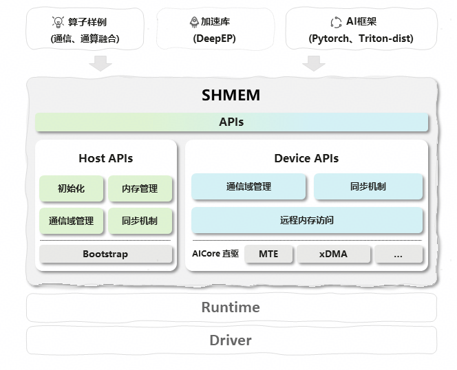
</figure>

在本篇技术报告中，我们将对SHMEM编程API在昇腾平台的使用方式和具体优化进行细致地阐述，通过dispatch&combine/kvoffload等典型场景为例详细描述shmem接口的调用方法。

## Highlights

- SHMEM API 支持NPU HBM&CPU DDR混合编址，优化KVoffload吞吐；
- HIXL支持SHMEM API，提供rH2D，d2RH 池化数据访问和通信能力；
- 通过cann shmem 使能通算融合编程，优化DeepEP中的dispatch&combine的通信调用方式；
- 通过tilelang，pypto使能shmem 通算融合编程，提升通算融合编程易用性；


# 使用SHMEM进行KVCache Offload优化

Offload 通过将 LLM 推理过程中的 KV Cache 卸载到 Host 内存中，减轻 Device 内存压力，和稀疏注意力结合，可以应对 LLM 长序列推理面临的内存瓶颈和计算瓶颈，增大 batch size，进而提高推理吞吐量。

在 Offload 过程中，很重要的一环是 KV Cache 在 Host 和 Device 之间的数据搬运，shmem 提供了统一的内存管理能力，使得模型侧无需感知 Host 和 Device 的内存差异，只需调用相应的 torch 接口，就可以实现 h2d 和 d2h 的数据搬运。同时得益于 shmem 对于集群内低延迟，高带宽通信的使能，Offload 过程中 KV Cache 的 h2d 耗时也有所减少，对于提高整网推理时延和吞吐量起到关键作用。

以 DeepSeek V3.2 为例

- 在模型初始化阶段，调用 shmem 的 torch 接口为将要卸载的 KV Cache 分配 Host 侧内存，并将其地址映射到 Device，模型推理过程中可以直接将这块内存当成 Device tensor 来使用。

```
cache_nope_bytes = cache_nope_tensor.untyped_storage().nbytes()
cache_nope_data_ptr = aclshmem_malloc(cache_nope_bytes, MemType.HOST_SIDE)
metadata = {
    "data_ptr": cache_nope_data_ptr,
    "device": cache_device,
    "nbytes": cache_nope_bytes,
    "dtype": dtype,
    "size": cache_nope_shape,
    "stride": cache_nope_tensor.stride(),
    "storage_offset": cache_nope_tensor.storage_offset(),
}
storage = torch_npu._C._construct_storage_from_data_pointer(
    metadata["data_ptr"], metadata["device"], metadata["nbytes"]
)
cache_nope = torch_npu._C._construct_NPU_Tensor_From_Storage_And_Metadata(metadata, storage)
```

- 在 Prefill 阶段，模型推理生成的 KV Cache 会被异步卸载到这块内存中；
- 在 Decoding 阶段，Lightning Indexer 生成稀疏注意力的 topk ids 之后，我们会调用 GatherSelectionKVCache 算子根据 topk ids 在 Host 内存中选择对应 token 的 KV Cache，这一过程中，算子直接操作映射后的 Device tensor，无需感知其在 Host 侧的内存排布，简化了算法流程。

```
# kv cache constructed by shmem and mapped into device tensor
full_kv_cache = k_nope.squeeze(2)
full_k_rope = k_pe.squeeze(2) if not self.kv_cache_c8 else offload_cache.empty_rope

selection_kv_actual_seq = torch_npu.npu_gather_selection_kv_cache(
    selection_k_rope, selection_kv_cache,
    selection_kv_block_table, selection_kv_block_status,
    topk_indices, full_k_rope, full_kv_cache,
    block_table, actual_seq_lengths_kv,
    actual_seq_qlen, selection_topk_block_size=1)
```

在使能 Offload + shmem 后，我们在 DeepSeek V3.2 上取得了明显的推理内存收益：基于 Atlas A3 64卡环境，64K 序列长度下，模型推理支持的最大 batch size 可以从 1024 增长到 2048。

为通过 Offload 进一步提高推理吞吐量，字节提出了 ShadowKV（吞吐提升 3 倍），百度提出了 ESS 系统（吞吐提升 123%），清华大学提出了 NOSA 结构，参考这些方案，未来 Offload + shmem 的优化方向包括：

（1）通过将更多高访问量的 Token Cache 缓存在 Device 侧，充分发挥 shmem 高带宽 d2d 的能力，减轻 Decoding 阶段 h2d 的压力，并结合并行掩盖技术，将 Gather 耗时隐藏于前向计算，吞吐量有望翻倍；

（2）参考 NOSA 等结构，在算法层面做出创新，突破 DeepSeek V3.2 每步迭代都需实时计算 Topk 并重新 Gather 的限制；（3）借助 shmem 跨机 rH2D、D2rH 的能力，在框架侧实现 Decoding 阶段跨机 Gather，避免全量 KV Cache 的 h2h 传输，进一步降低推理时延。

# 基于SHMEM实现HIXL单边通信并集成至Mooncake社区

随着LLM上下文窗口持续突破至128K乃至百万级token规模，超长序列在处理长文档分析、多轮复杂对话、代码生成等高阶场景时，其核心瓶颈已从传统的计算算力约束转向存储子系统与数据传输效率的双重挑战。
KV Cache随序列长度呈线性增长特性，在超长序列场景下其容量可达到数十GB级，远超单卡NPU HBM承载上限，进而触发必须将部分或全部KV Cache数据卸载至CPU侧DRAM的部署策略。这一架构适配性调整，虽有效突破了“显存墙”限制、提升了并发请求处理能力，但也引入了NPU与DRAM之间高频次的数据交互需求，其中PUT D2rH（Device to Remote Host）及GET rH2D（Remote Host to Device）的高性能传输诉求，成为制约整体推理吞吐量与延迟表现的核心技术痛点。

## HIXL介绍

HIXL（Huawei Xfer Library）是一个灵活、高效的昇腾单边通信库，面向集群场景提供简单、可靠、高效的点对点数据传输能力，并通过简易API开放给用户。HIXL基于SHMEM机制，可高效解决PUT D2rH 与 GET rH2D 场景下的高性能传输问题，为超长序列LLM推理的存储与传输瓶颈提供针对性解决方案。HIXL核心优势体现在三方面：

1. 支持单边零拷贝（One-Sided Zero-Copy）通信机制；
2. 屏蔽硬件差异，兼容多链路实现跨设备高速互联；
3. 极简API设计，深度适配开源生态框架。
   HIXL当前已与Mooncake社区深度集成，可实现KV Cache低延迟传输及池化复用等典型业务场景。更多信息信息可参考HIXL开源仓：https://gitcode.com/cann/hixl。

## HIXL集成SHMEM

HIXL集成SHMEM的核心目标是实现跨进程的全局统一编址，依托SHMEM的内存共享机制，使各进程可直接访问彼此的DRAM内存空间，无需内核态数据拷贝，从而实现高性能传输。其技术实现逻辑如下：

1. 内存申请：各进程独立向本地DRAM申请私有内存段，获取该内存段的虚拟地址与本地物理地址；
2. 地址交换：各进程将自身内存段的物理地址信息（包括基址、长度、权限等）同步至集群内所有参与进程，完成全局物理地址池的构建；
3. 跨进程页表映射：各进程将接收到的其它进程内存物理地址，映射到自身虚拟地址空间，形成全局统一的虚拟——物理地址映射关系，实现 “一处编址、全域可达”；
4. SDMA数据访问：基于全局统一编址，通过SDMA引擎发起远程内存读写操作，直接访问任意进程的DRAM内存，无需进程间显式交互。
<p align = "center">
    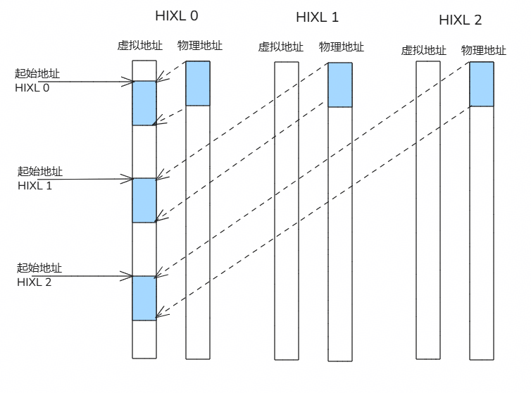
</figure>

HIXL可配置OPTION_ENABLE_USE_FABRIC_MEM, 1: 开启SHMEM模式，0：不开启SHMEM模式。

## 性能测试结果

基于A3超节点，测试HIXL（SHMEM）性能数据如下所示：

1. 双机单卡1对1, 一个block的数据量：模拟DeepSeek-R1 KV大小，即：61x128K + 61x16K = 8784KB, 测试传输100次取平均，剔除第一次带建立链接的时间。（下同）
<p align = "center">
    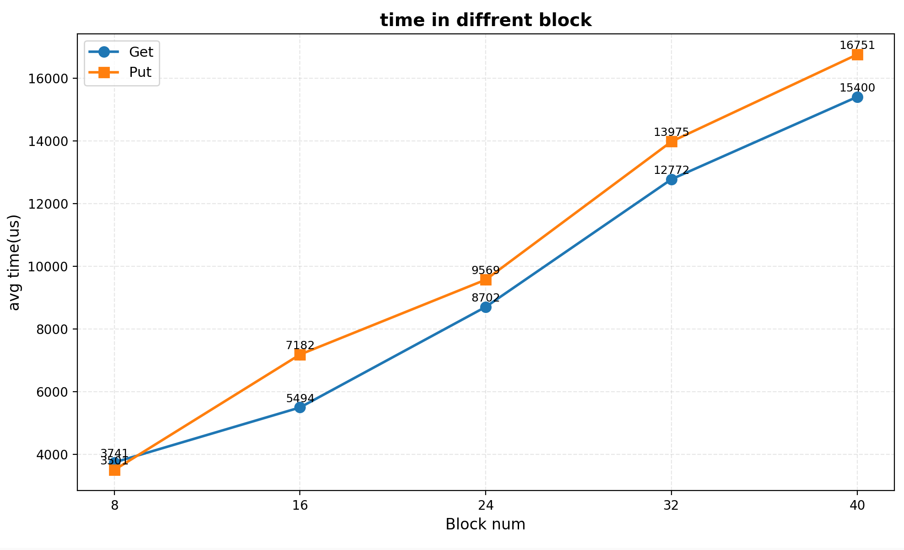
</figure>

2. 双机16卡1对1
 <p align = "center">
    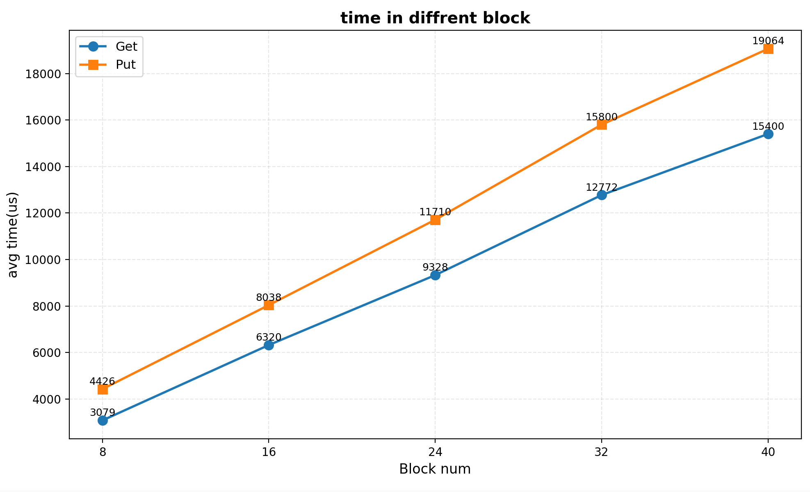
</figure>

3. 双机单卡1对1大块数据量测试
<p align = "center">
    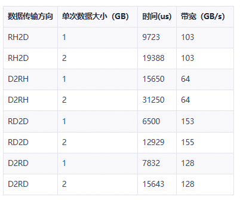
</figure>

# 基于SHMEM实现Dispatch&Combine并集成至DeepEP

## Dispatch&Combine介绍

DeepEP的Dispatch和Combine是 Mixture of Experts（MoE, 混合专家）专家并行（EP）中All to All通信的核心操作，分别负责任务分发与结果聚合，适配训练高吞吐与推理低延迟两大场景，是性能的关键保障。

### Dispatch

- 必选输入包括：x，expertIds；
  x为待分发的原始 token 表示。每个 token 将根据路由结果被发送给一个或多个专家。
  expertIds由 Router 生成的专家分配索引。expertIds[i, j] 表示第 i 个 token 的第 j 个被选中的 expert ID（0 ≤ expertId < num_experts）。

- 输出主要包括：expandXOut，assistInfoForCombineOut，expertTokenNumsOut，epRecvCountsOut；
  expandXOut为本rank接受到来自其他rank的，并按专家顺序重排后的输入 token 张量
  assistInfoForCombineOut为三元组信息，包含（来自哪个rank，来自哪个token，来自该token的第k次发送）
  expertTokenNumsOut为表示每个专家收到的token个数。
  epRecvCountsOut表示从EP通信域各卡接收的token数（对应CombineV2系列算子中的epSendCounts）。

- 算子执行流程 
  发数据——>发状态——>等状态——>本地win区数据拷贝

1. 发数据：
   假设当前x的shape为[Bs，H]，expertIds的shape为[Bs, K]，Bs个token中每个token都会发送K次到不同的expert上，因此实现了token往不同rank的不同专家分发的效果即Dispatch
2. 发状态：
   状态区的作用是为了标记本rank所需要的接收的来自其他rank的数据的发送状态（即是否发完），主要关注点为两个数据，一个是flag，当flag为1的时候代表来自某rank发往某expert的数据已经发送完毕，并且置为1，cnt表示来自某rank发往某expert的数据的个数
<p align = "center">
    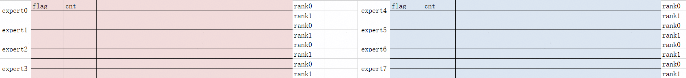
</figure>

3. 等状态：
   由于当前rank也会接受来自其他卡dispatch过来的数据，因此需要不断的通过循环去看当前rank接受的数据是否接受完毕，即去当前rank的状态区，去通过while获取flag的求和结果，如果当前的求和结果满足了对应的要求，则会跳出当前等状态的循环，即代表当前rank已经接受完毕来自其他rank发过来的token
4. 本地win区数据拷贝：
   在等状态结束后，即可以去本rank的win区数据区拷贝数据到本rank的UB，然后再通过UB把接收的数据给搬运到本rank的GM上实现Dispatch最终输出数据
   win区数据区的大致结构如下：
<p align = "center">
    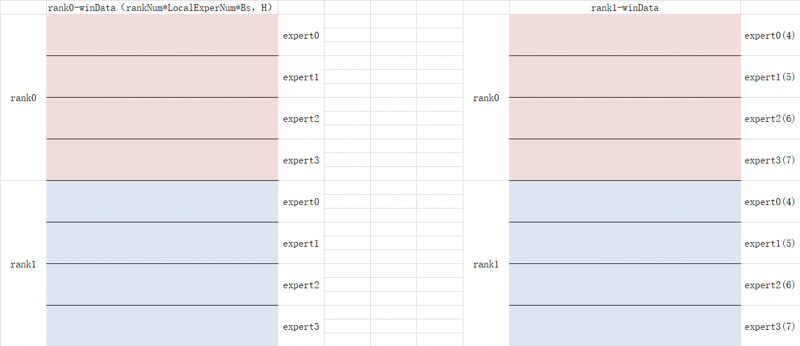
</figure>

   左边是rank0的win数据区，红色部分代表rank0接收到来自rank0的数据，蓝色部分代表rank0接收到来自rank1的数据，由于等状态已经结束，当前只需要把红色部分的数据和蓝色部分的数据给搬运到本rank0的UB，然后再搬出到rank0的win区，对于右侧的rank1也是同理。
   当然，这里面win数据区每一行不仅包含了token的信息，还包含了量化参数信息，三元组信息，把对应的数据通过切片方式搬运即可形成例如expandXOut、assistInfoForCombineOut


### Combine

通过Dispatch算子后，token被发往不同的专家进行处理，然后Combine的作用则是把这些专家处理后的数据给一一退还回其原来所属rank，combine算子与dispatch算子本质上是一个逆映射的关系。

- combine算子的输入包含：expandX、assistInfoForCombine、epSendCounts
  expandX的含义表示为经过Dispatch发送到本rank数据，经过expert处理后的数据（即要还回原来rank的数据）
  assistInfoForCombine表示为要还回对应rank的数据的三元组信息，通过该信息即可知道某条token来自哪个rank的哪个token的第几次发送
  epSendCounts表示从EP通信域各卡接收的token数，对应MoeDistributeDispatchV2中的epRecvCounts输出。

- combine算子的输出为xOut，即通过combine后，把原来从本卡发出去的数据经过来自各个rank的expert处理后的数据

combine算子的执行过程包含：发数据——>发状态——>等状态——>本地数据拷贝

1. 发数据过程：
   由于已经有了三元组的信息，存储在assistInfoForCombine，那么久可以根据其中表达的某rank，某专家，第某次发送，通过for循环一条条处理本卡要还的token，把一条条token还到对应的rank的win数据区正确的位置。
<p align = "center">
    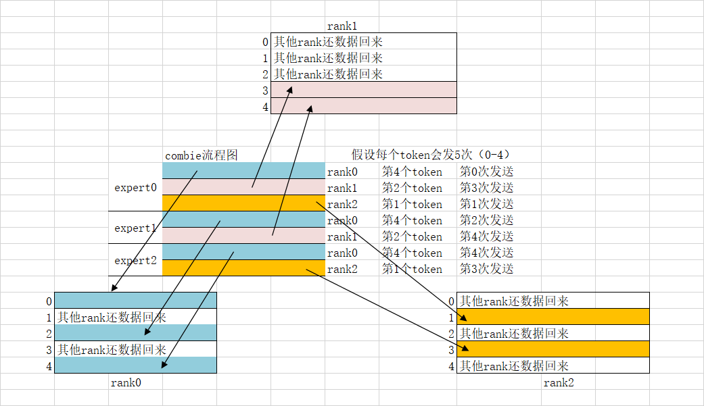
</figure>

2. 发状态：
   在发数据的时候就可以发状态，发一条数据就可以发一条状态，和dispatch不同的是，发状态直接把对应该token的整条状态区全部填充为1,

3. 等状态：
   本rank除了要通过for循环完成发数据和发状态后，还要通过一个while循环不断的等状态，比如当前rank在dispatch的时候就有A个token，然后每个token发K次，那么理论本rank应该能接受到通过combine返回的A*K个token，然后while等待的目标则是去看这些token对应的状态区是否求和等于其目标值，若为目标值则代表本rank所发出去的数据全部都还回来了，此时等状态逻辑完毕

4. 本地数据拷贝与处理：
   本rank需要的A*K个token已经在本rank的win数据区了，当前就是要把这些数据给搬运到UB进行数据处理后，再搬出到本rank的win区。数据处理的思路为，K个批量处理，一共处理A次对应原本rank的A个token，每一个批次的K个token为当前这个token重复发K次后换回来的K个数据（这K个数据是同一个token被不同rank上不同expert处理后的结果），要做的就是通过某种方式将这K个数据融合，最后得到一个融合了K个专家处理后的该token。然后把这个融合K个token的这一个token搬运到UB上，这个过程执行A次，即完成了combine算子的XOut结果，
   下图为rank1把自己win数据区融合最后得到最终处理后数据得示意图，其他rank同理
<p align = "center">
    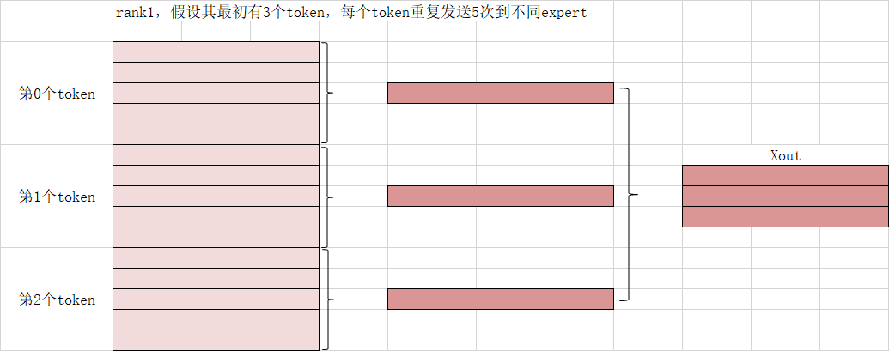
</figure>

## 使用shmem api实现dispatch&combine算子

 基于对称内存机制，可基于SHMEM高效完成通算融合算子开发，下图展示了shmem对称内存的基本原理。
<p align = "center">
    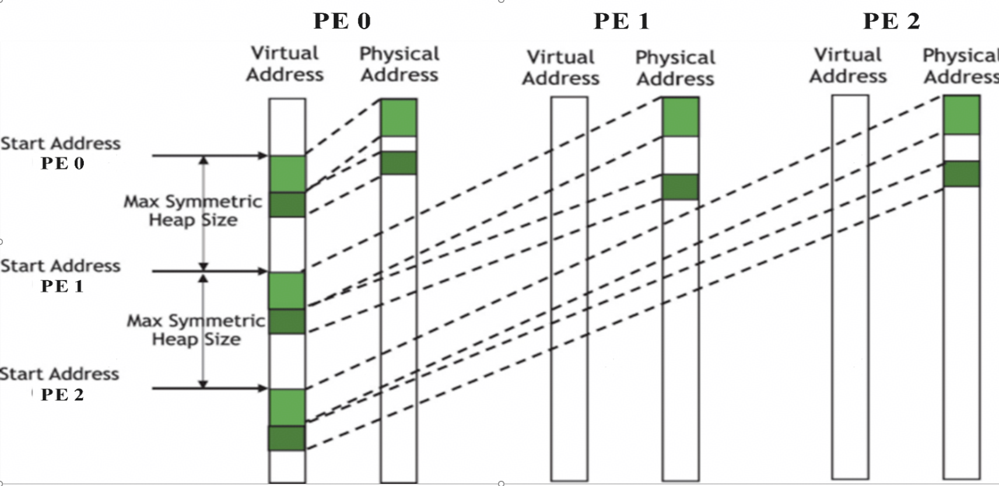
</figure>

### 算子开发流程

#### shmem初始化

   1. “***_pyshmem.MoeDistributeCppBuffer(30010241024, 1)***” 指定为当前die分配的内存空间，单位为字节，此区域为数据区和状态区共用。使用内存的总大小不可超过分配的内存大小。

   2. “***ret = dc_buffer.ShmemInit(16, rank, t)***” 规定当前die的rank_id以及当前通信的总die数。

   3. “***shmem_context = dc_buffer.InitAndGetMC2CommContext()*** ” 把共享内存信息，封装进shmem_context，作为入参传给算子
<p align = "center">
    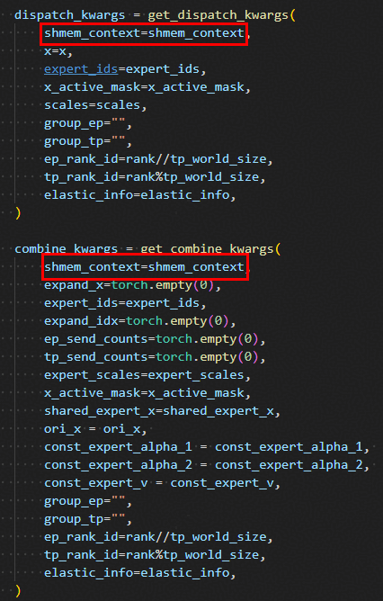
</figure>

#### SHMEM使能

   - 算子内通过GetShmemDataAddr和GetShmemSignalAddr接口获取目标对端卡数据区和状态区的内存起始地址。
   - shmem方案里，状态区紧跟在数据区后面，context->shmem_addr对应当前卡的shmem内存起址。
   - die集群共享一个全局虚拟地址，die与die之间的内存步距设为1G，用户可根据需要决定分配内存的次数和大小，但单die分配的内存总大小不可超过1G。
<p align = "center">
    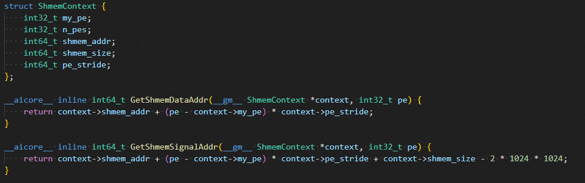
</figure>

### 整网接入及效果

1. 在modeling_deepseek.py同级目录下，放置基于shmem仓编译出的libcommshmem.so和_pyshmem.cpython-311-aarch64-linux-gnu.so动态库文件，以支持封装的shmem API接口调用。

2. 封装init_shmem_once函数，确保shmem内存初始化在整网执行流程里只调用一次。当调用超过一次时，函数自动返回（整网里shmem内存初始化次数超过一次会报错）。将该函数放置DeepseekV3ForCausalLM类的__init__函数下。
<p align = "center">
    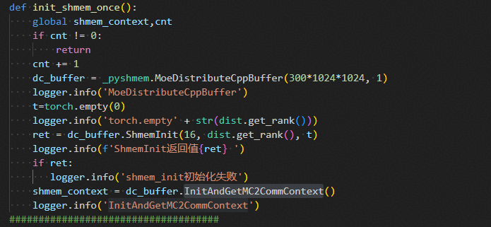
</figure>

3. dispatch和combine的入参里均添加shmem_context入参，此入参包含了为当前die分配的内存起址和内存大小信息，由shmem接口shmem_get_context获取。
<p align = "center">
    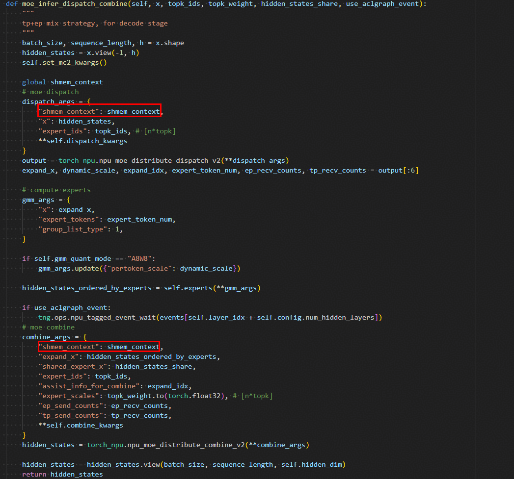
</figure>

4. 将原生torch_npu的dispatch和combine替换成shmem版本的dispatch, combine。


## 使用集成SHMEM的编程框架实现dispatch&combine算子


除原生Shmem api外，Cann Shmem还支持接入多种编程框架，如Tilelang，pypto。下面将分别介绍基于Tilelang-shmem和pyPTO-shmem开发dispatch&combine算子的流程。

### 使用Tilelang-shmem实现dispatch&combine算子

#### Tilelang简介

TileLang是一种面向tile级别编程的DSL，采用类Python的语法，在TVM之上构建底层编译器基础架构，针对特定硬件优化代码，使开发者能够以一种高级的方式表达和优化底层内核行为。TileLang可以让开发者显式控制内存分配、数据移动、布局和并行执行，于此同时，Tilelang封装了各类丰富的API，使开发者开发算子更加方便。

#### 基于Tilelang-shmem的算子实现流程

下图展示了dispatch&combine算子的实现流程

1. 加载Tilelang和shmem运行需要的环境
2. 利用Tilelang源语编写dispatch算子
3. 利用Tilelang源语编写combine算子
4. 启用多线程，构造dispatch所需的输入数据，利用shmem申请Win区所需空间，并调用dispatch和combine算子，将构造好的数据传入算子中，实现算子跨卡或跨机功能。
<p align = "center">
    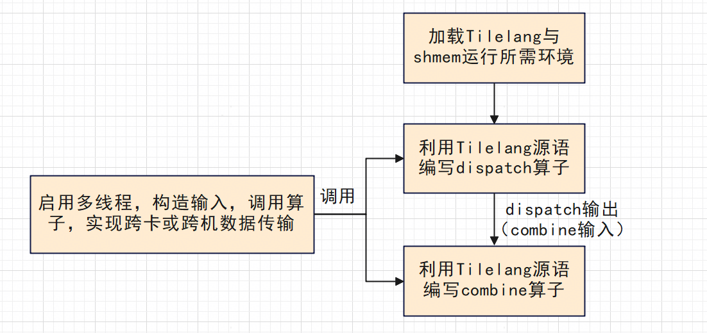
</figure>

#### dispatch算子实现

算子实现包括参数输入、发数据、发状态、等状态和本地Win区数据拷贝功能。

```
@tilelang.jit(out_idx=[4,5,6,7],
def moe_dispatch_kernel(
    Bs,
    H,
    K,
    ep_world_size,
    local_expert_num,
    rank,
    ub_size,
    ai_core_num,
):
    aiv_num = ai_core_num * 2
    total_expert_num = ep_world_size * local_expert_num
    ub_align = 32
    status_per_core = (total_expert_num + aiv_num - 1) // aiv_num
    @T.prim_func
    def main_dispatch(
        x: T.Tensor([Bs, H], "bfloat16"),
        expert_ids: T.Tensor([Bs, K], "int32"),
        win_data: T.Tensor([total_expert_num * Bs, ub_size], "bfloat16"),
        win_status: T.Tensor([total_expert_num, 8], "float"),
        expandXOut: T.Tensor([ep_world_size * Bs * local_expert_num, H], "bfloat16"),
        expand_ids: T.Tensor([ep_world_size * Bs * local_expert_num, 3], "int32"),
        ep_receive_count: T.Tensor([total_expert_num], "int32"),
        expert_token_nums_out: T.Tensor([local_expert_num], "int64"),
        workspace: T.Tensor([aiv_num,8], "int32"),
    ):
        with T.Kernel(ai_core_num, is_npu=True) as (cid, vid):
            x_ub = T.alloc_ub([H + (32 + 12) // 2], "bfloat16")
            ...
            with T.Scope("C"):
                T.sync_all()
                ...
            with T.Scope("V"):
                send_token_num = cur_send_token_cnt // aiv_num
                remainder_token_num = cur_send_token_cnt % aiv_num
                start_send_token_id = send_token_num * true_vid
                ...
                # 发数据
                for cur_send_token_id in range(start_send_token_id, start_send_token_id + send_token_num):
                    ...
                    T.shmem_ub_put_nbi_new(x_ub, win_data, ub_size, dest_rank_id, (rank * Bs * local_expert_num + dest_expert_id * Bs + token_repeat_num[0]) * ub_size)
                # 发状态
                for cur_expert_id in range(start_expert_id, start_expert_id + aiv_expert_num):
                    ...
                    T.shmem_ub_put_nbi_new(win_status_ub_single, win_status, 8, dest_rank_id, local_expert_id * ep_world_size * 8 + rank * 8)
                # 循环等状态
                while (sum_of_flag[0] != aiv_expert_fp_num):
                    ...
                # 本地win区数据拷贝
                for i in range(status_num_per_core):
                    ...
    return main_dispatch
```

**基本参数设置**

* **moe_dispatch_kernel**：dispatch算子定义的函数名，为后续调用时使用
* **Bs**：每张卡token数量
* **H**：token长度
* **K**：每个token发送moe专家个数
* **ep_world_size**：启用的总卡数
* **local_expert_num**：每张卡moe专家个数
* **rank**：当前卡id
* **ub_size**：申请Win区大小
* **ai_core_num**：启用的ai核数

**输入、输出张量设置**

* **x**：待分发的原始 token（输入）
* **expert_ids**：专家id张量（输入）
* **win_data**：输入申请的Win区数据区内存（输入）
* **win_status**：申请的Win区状态区内存（输入）
* **expandXOut**：本卡接受到来自其他卡的，并按专家顺序重排后的输入 token 张量（输出）
* **expand_ids**：三元组信息（输出）
* **ep_receive_count**：从EP通信域各卡接收的token数（输出）
* **expert_token_nums_out**：每个专家收到的token个数（输出）

**API使用方法**
Tilelang中封装了大量API，上文代码中展示了几个，如：

* **T.alloc_ub**：申请ub上内存空间，使用样例为：T.alloc_ub(shape, dtype)
* **T.sync_all()**：核间同步
* **T.shmem_ub_put_nbi*_new***：Tilelang中封装的shmem接口，用于将本卡ub数据传送到Win区，使用样例为：T.shmem_ub_put_nbi_new(x_ub, win, ub_size, dest_rank_id, stride)，其中x_ub为本卡ub数据，win为申请得到的win区，ub_size为ub大小，dest_rank_id为对端卡id，stride为偏移量。

#### combine算子实现

算子实现包括参数输入、发数据、发状态、等状态和本地Win区数据拷贝功能。

```
@tilelang.jit(out_idx=[5],
def moe_combine_kernel(
    Bs,
    M,
    H,
    K,
    ep_world_size,
    local_expert_num,
    rank,
    ai_core_num,
):
    aiv_num = 2 * ai_core_num
    assist_size = 3
    token_per_core = (M + aiv_num - 1) // aiv_num
    float_align_ub = 8
    @T.prim_func
    def main_combine(
        expandX: T.Tensor([M, H], "bfloat16"),
        assistInfoCombine: T.Tensor([M, assist_size], "int32"),
        epSendCounts: T.Tensor([local_expert_num * ep_world_size], "int32"),
        winData: T.Tensor([Bs * K, H], "bfloat16"),
        winStatus: T.Tensor([Bs * K, 8], "float"),
        combineOut: T.Tensor([Bs, H], "bfloat16")
    ):
        with T.Kernel(ai_core_num, is_npu=True) as (cid, vid):
            x_ub = T.alloc_ub([H], "bfloat16")
            ...
            with T.Scope("V"):
                T.tile.fill(statusUb, 1.0)
                ...
                # 发数据、发状态
                for loop in range(sendTokenNum[0]):
                    ...
                    T.shmem_ub_put_nbi_new(x_ub, winData, H, toRankId, winGM * H)

                    T.shmem_ub_put_nbi_new(statusUb, winStatus, 8, toRankId, winGM * 8)
                for curIdx in range(startTokenId[0], startTokenId[0] + tokenNum[0]):
                    sumOfFlag[0] = -1.0
                    stateGM = curIdx * K
                    calCnt = compareTarget
                    # 等状态
                    while((sumOfFlag[0] < targetMin) or (sumOfFlag[0] > targetMax)):
                        ...
                    # 本地win区数据拷贝
                    T.copy(winData[tokenIndexOffset, 0], winData_ub_bfloat)
                    T.copy(winData_ub_bfloat, combineOut[curIdx,0])
    return main_combine
```

**基本参数设置**（***抽成公共，tilelang单独描述差异***）

* **moe_combine_kernel**：combine算子定义的函数名，为后续调用时使用
* **Bs**：每张卡dispatch发送的时候token数
* **M**：当前卡总共接收到的token数
* **H**：token长度
* **K**：每个token发送moe专家个数
* **ep_world_size**：启用的总卡数
* **local_expert_num**：每张卡moe专家个数
* **rank**：当前卡id
* **ai_core_num**：启用的ai核数

**输入、输出张量设置**

* **expandX**：经过Dispatch发送到本卡数据（输入）
* **assistInfoCombine**：要还回对应卡的数据的三元组信息（输入）
* **epSendCounts**：从EP通信域各卡接收的token数（输入）
* **winData**：申请的Win区数据区内存（输入）
* **winStatus**：申请的Win区数据区内存（输入）
* **combineOut**：算子的输出（输出）

**API使用方法**
算子实现同样需要大量API，用法与dispatch中一致。

#### 启用多线程、调用dispatch&combine算子，实现算子功能

```
G_IP_PORT = "tcp://100.102.180.145:8666"
g_ash_size = 1024 * 1024 * 1024
num_processes = 16
def worker(rank, barrier, x, expert_ids):
    ...
    # 初始化aclshmem
    ret = aclshmem_module.aclshmem_init(attributes)
    if ret == 0:
        ...
        # 申请win区
        tensorData_dispatch = aclshmem_module.aclshmem_create_tensor([epWorldSize * localExpertNum * Bs, ub_size], dtype=torch.bfloat16,
                                                    device_id=rank)
        tensorStatus_dispatch = aclshmem_module.aclshmem_create_tensor([epWorldSize * localExpertNum , 8], dtype=torch.float,
                                                    device_id=rank)
        tensor_combine = aclshmem_module.aclshmem_create_tensor([Bs * K, H], dtype=torch.bfloat16, device_id=rank)
        tensorStatus_combine = aclshmem_module.aclshmem_create_tensor([Bs * K, 8], dtype=torch.float, device_id=rank)
        Win_dispatch = tensorData_dispatch.fill_(0)
        winStatus_dispatch = tensorStatus_dispatch.fill_(0)
        Win_combine = tensor_combine.fill_(0)
        winStatus_combine = tensorStatus_combine.fill_(0)
        workspace_1 = torch.zeros((aivNum, 8), dtype=torch.int32).npu()
        # 调用dispatch算子
        func_dispatch = moe_dispatch_kernel(Bs, H, K, epWorldSize, localExpertNum, rank, ub_size, aiCoreNum)
        expand_x, expand_idx, ep_recv_counts, expert_token_nums = func_dispatch(x, expert_ids, Win_dispatch, winStatus_dispatch, workspace_1)
        # 调用combine算子
        expand_x = expand_x[:ep_recv_counts[-1].item(),:]
        expand_idx = expand_idx[:ep_recv_counts[-1].item(),:]
        func_combine = moe_combine_kernel(Bs, ep_recv_counts[-1].item(), H, K, epWorldSize, localExpertNum, rank, aiCoreNum)
        x_out = func_combine(expand_x, expand_idx, ep_recv_counts, Win_combine, winStatus_combine)
        ...
    else:
        print(f"Rank {rank}: Initialization failed with code {ret}")
    # 清理
    aclshmem_module.aclshmem_finialize()
    print(f"Rank {rank}: Finalized")

for rank in range(num_processes):
    x, expert_ids = init_input(rank, Bs, H, K, epWorldSize, localExpertNum)
    p = mp.Process(target=worker, args=(rank, barrier, x, expert_ids))
    p.start()
    processes.append(p)
for p in processes:
    p.join()
```

* **G_IP_PORT**：本机的IP地址
* **g_ash_size**：可以申请的Win最大空间大小为1G
* **num_processes**：启用的进程数

首先通过aclshmem_module.aclshmem_init进行初始化，然后利用aclshmem_module.aclshmem_create_tensor申请需要大小的Win区空间，并根据之前定义的dispatch和combine算子名调用算子。dispatch的输出会作为combine的输入传入，最终由combine输出结果。

### 使用pyPTO-shmem实现dispatch&combine算子

#### pyPTO简介：

PyPTO（发音: pai p-t-o）是一款面向 AI 加速器的高性能编程框架, 旨在简化复杂融合算子乃至整个模型网络的开发流程, 同时保持高性能计算能力. 该框架采用创新的 **PTO（Parallel Tensor/Tile Operation）编程范式**, 以 **基于 Tile 的编程模型** 为核心设计理念, 通过多层次的中间表示（IR）系统, 将用户通过 API 构建的 AI 模型应用从高层次的 Tensor 图逐步编译成硬件指令, 最终生成可在目标平台上高效执行的可执行代码.


#### pyPTO-shmem API介绍

PyPTO中实现了 OPENSHMEM 部分通信语义，并且封装为API，供用户调用：

* **shmem_put**：将本地数据（local tensor）发送到对称内存（shmem tensor）中指定位置
* **shmem_get**：从对称内存（shmem tensor）中指定位置获取数据存放到本地（local tensor）
* **shmem_signal**：给其他卡发送信号
* **shmem_wait**：等待本卡信号，指定signal等于指定值
* **shmem_barrier_all**：通信域内卡间同步，当所有卡都到达此同步点才会解除继续执行

此外也实现了部分非标准 OPENSHMEM 语义：

* **create_shmem_tensor**：在指定通信域内创建表示对称内存的Tensor
* **shmem_clear_data**：将shmem tensor的数据清零
* **shmem_signal_data**：将shmem signal清零
* **my_symbolic_pe**：本卡符号化的rank id

#### 基于pyPTO-shmem的算子实现流程

##### dispatch算子实现

在PyPTO中，dispatch算子被描述为三张子图：

* **send_token**：通过shmem api将token及对应token信息按照专家表发送到共享内存，发送完成后通知其他rank发送完成
* **send_signal**：token 发送完成后，通知其他卡
* **receive_token**：接收来自其他卡的token

具体代码实现主要部分如下：

```
LOOP("send_token_col", FunctionType::DYNAMIC_LOOP, rowIndex, LoopRange(batchSize)) {
    LOOP("send_token_col", FunctionType::DYNAMIC_LOOP, colIndex, LoopRange(topK)) {
        Tensor moeSendMsg(DataType::DT_INT32, moeSendMsgShape, "moeSendMsg");
        Tensor tensorTile = View(x, {1, hiddenSize}, {rowIndex, 0});
        TileShape::Current().SetVecTile({1, infoSize});
        SetTensorData(thisRank, {0, 0}, moeSendMsg);
        SetTensorData(rowIndex, {0, 1}, moeSendMsg);
        SetTensorData(colIndex, {0, 2}, moeSendMsg);
        SymbolicScalar remoteExpertId = GetTensorData(expertIds, {rowIndex, colIndex});
        SymbolicScalar tokenOffset = GetTensorData(offsetTable, {rowIndex, colIndex});
        SymbolicScalar remoteExpertOffset = remoteExpertId % expertNumPerRank;
        SymbolicScalar remoteRankId = remoteExpertId / expertNumPerRank;
        Tensor shmemDataTile = View(shmemData, {1, 1, 1, hiddenSize}, std::vector<SymbolicScalar>{remoteRankId, remoteExpertOffset * epWorldSize + thisRank, tokenOffset, 0});
        Tensor shmemInfoTile = View(shmemInfo, {1, 1, 1, infoSize}, std::vector<SymbolicScalar>{remoteRankId, remoteExpertOffset * epWorldSize + thisRank, tokenOffset, 0});
        TileShape::Current().SetVecTile({1, hiddenSize});
        Tensor shmemDataPutOut = ShmemPut(tensorTile, tensorTile, shmemDataTile);
        TileShape::Current().SetVecTile({1, infoSize});
        Tensor shmemInfoPutOut = ShmemPut(moeSendMsg, moeSendMsg, shmemInfoTile);
        shmemSendOut = Nop({shmemDataPutOut, shmemInfoPutOut});
    }
}

Tensor shmemCountOut(DT_INT32, {1, 1}, "shmemCountOut");
LOOP("send_signal", FunctionType::DYNAMIC_LOOP, expertId, LoopRange(moeExpertNum)) {
    TileShape::Current().SetVecTile({1, 1});
    SymbolicScalar remoteRankId = expertId / expertNumPerRankScalar;
    SymbolicScalar remoteExpertOffset = expertId % expertNumPerRankScalar;
    Tensor shmemCountTile = View(shmemCount, {1, 1, 1, 1}, {remoteRankId, 0, remoteExpertOffset * epWorldSize + thisRank + 1, 0});
    Tensor totalOffsetTile = View(totalOffset, {1, 1}, {expertId, 0});
    Tensor shmemPutOut = ShmemPut(shmemSendOut, totalOffsetTile, shmemCountTile);
    TileShape::Current().SetVecTile({1, signalCol});
    Tensor shmemSignalTile = View(shmemSignal, {1, 1, 1, 1, signalCol}, {remoteRankId, 0, 0, 0, 0});
    shmemCountOut = ShmemSignal(shmemPutOut, shmemSignalTile, AtomicType::ADD);
}

LOOP("receive_token", FunctionType::DYNAMIC_LOOP, i, LoopRange(1)) {
    (void) i;
    TileShape::Current().SetVecTile({1, signalCol});
    Tensor shmemSignalLocalTile = View(shmemSignal, {1, 1, 1, 1, signalCol}, {thisRank, 0, 0, 0, 0});
    Tensor waitUntilOut = WaitUntil(shmemCountOut, shmemSignalLocalTile, moeExpertNum, true);
    TileShape::Current().SetVecTile({expertNumPerRank * epWorldSize + 1, 1});
    Tensor shmemCountTile = View(shmemCount, {1, 1, expertNumPerRank * epWorldSize + 1, countSize}, std::vector<SymbolicScalar>{1, 1, expertNumPerRank * epWorldSize, 1},{thisRank, 0, 0, 0});
    Tensor shmemGetOut = ShmemGet(waitUntilOut, shmemCountTile);
    Tensor cumSumCurrent = CumSum(shmemGetOut, 0);
    Tensor cumSumResult = Cast(cumSumCurrent, DT_INT32, CAST_TRUNC);
    for (uint32_t index = 0; index < expertNumPerRank * epWorldSize; ++index) {
        TileShape::Current().SetVecTile({1, countSize});
        Tensor shmemReceiveCountTile = View(shmemCount, {1, 1, 1, countSize}, {thisRank, 0, index, 0});
        Tensor localExpertRecvCount = ShmemGet(cumSumResult, shmemReceiveCountTile);
        SymbolicScalar curCount = GetTensorData(localExpertRecvCount, {0, 0}); // 当前专家的这个卡拿了多少条数据
        SymbolicScalar offset = GetTensorData(cumSumResult, {index, 0}); // 当前专家的这个卡的数据在expandX的起始偏移
        // 获取有效token
        Tensor curShmemDataTile = View(shmemData, {1, 1, batchSize, hiddenSize}, std::vector<SymbolicScalar>{1, 1, curCount, hiddenSize},
            {thisRank, index, 0, 0});
        TileShape::Current().SetVecTile({1, hiddenSize});
        Tensor localDataRecvCount = ShmemGet(localExpertRecvCount, curShmemDataTile);
        Assemble(localDataRecvCount, std::vector<SymbolicScalar>{offset, 0}, expandX);
        auto curShmemInfoTile = View(shmemInfo, {1, 1, batchSize, infoSize}, std::vector<SymbolicScalar>{1, 1, curCount, infoSize},
            {thisRank, index, 0, 0});
        TileShape::Current().SetVecTile({1, infoSize});
        Tensor localInfoRecvCount = ShmemGet(localExpertRecvCount, curShmemInfoTile, std::vector<SymbolicScalar>{curCount, infoSize});
        Assemble(localInfoRecvCount, {offset, 0}, assistInfoForCombine);
    }
}

```

##### combine算子实现

在PyPTO中，combine算子主要被描述为两张子图：

* **send**：借助assistInfoForCombine，将token原路返回发送到共享内存区
* **receive**：接收处理完之后的token，并且按照专家权重做加权平均

主要代码如下：

```
LOOP("send", FunctionType::DYNAMIC_LOOP, rowIndex, LoopRange(recvCountsScalar), unrollList) {
    SymbolicScalar rankId = GetTensorData(assistInfoForCombine, {rowIndex, 0});
    SymbolicScalar tokenId = GetTensorData(assistInfoForCombine, {rowIndex, 1});
    SymbolicScalar kOffset = GetTensorData(assistInfoForCombine, {rowIndex, 2});

    Tensor expandXTile = View(expandX, {1, hiddenSize}, {rowIndex, 0});
    Tensor shmemDataTile = View(shmemData, {1, 1, 1, hiddenSize}, {rankId, 0, topK * tokenId + kOffset, 0});
    TileShape::Current().SetVecTile({1, hiddenSize});
    Tensor predToken(DT_INT32, {1, 1}, "predToken");
    Tensor shmemPutOut = ShmemPut(predToken, expandXTile, shmemDataTile);

    Tensor shmemSignalTile = View(shmemSignal, {1, 1, 1, 1, hiddenSize}, {rankId, 0, 0, tokenId, 0});
    Tensor shmemSignalOut = ShmemSignal(shmemPutOut, shmemSignalTile, AtomicType::ADD);
    Assemble(shmemSignalOut, {rowIndex, 0}, sendOut);
}

SymbolicScalar thisRank = GetHcclRankId(group);
LOOP("receive", FunctionType::DYNAMIC_LOOP, tokenId, LoopRange(batchSize)) {
    Tensor shmemSignalTile = View(shmemSignal, {1, 1, 1, 1, hiddenSize}, {thisRank, 0, 0, tokenId, 0});
    TileShape::Current().SetVecTile({1, hiddenSize});
    Tensor waitUntilOut = WaitUntil(sendOut, shmemSignalTile, topK);

    TileShape::Current().SetVecTile({topK, hiddenSize});
    Tensor shmemDataTile = View(shmemData, {1, 1, topK, hiddenSize}, {thisRank, 0, topK * tokenId, 0});
    Tensor shmemGetOutFp16 = ShmemGet(waitUntilOut, shmemDataTile);

    TileShape::Current().SetVecTile({topK / 2, hiddenSize});
    Tensor shmemGetOutFp32 = npu::tile_fwk::Cast(shmemGetOutFp16, DT_FP32);

    Tensor expertScalesTile = View(expertScales, {1, topK}, {tokenId, 0});
    int64_t kTileShape = AlignUp(topK, 16);
    int64_t l0bSize = 65536;
    ASSERT((BytesOf(DT_FP32) != 0) && (kTileShape != 0));
    int64_t nTileShape = l0bSize / BytesOf(DT_FP32) / kTileShape;
    TileShape::Current().SetCubeTile({1, 1}, {kTileShape, kTileShape}, {nTileShape, nTileShape});
    Tensor matmulOutFp32 = Matrix::Matmul(DT_FP32, expertScalesTile, shmemGetOutFp32);

    Tensor matmulOutFp16 = npu::tile_fwk::Cast(matmulOutFp32, DT_BF16);

    Assemble(matmulOutFp16, {tokenId, 0}, out);
}

```

#### 运行dispatch&combine

请参考[如何运行PyPTO 里的 Dispatch 算子和 Combine 算子](https://gitcode.com/cann/pypto/blob/master/framework/tests/st/distributed/ops/docs/Dispatch%20and%20Combine%20Testcase%20User%20Guide.md)

