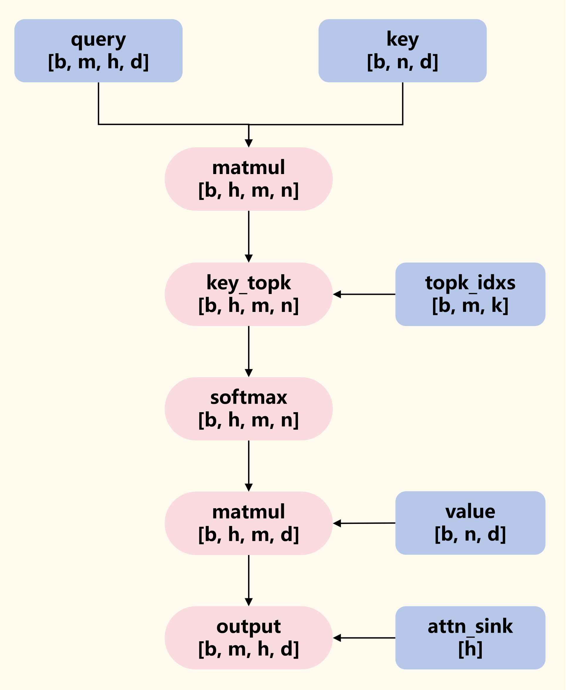
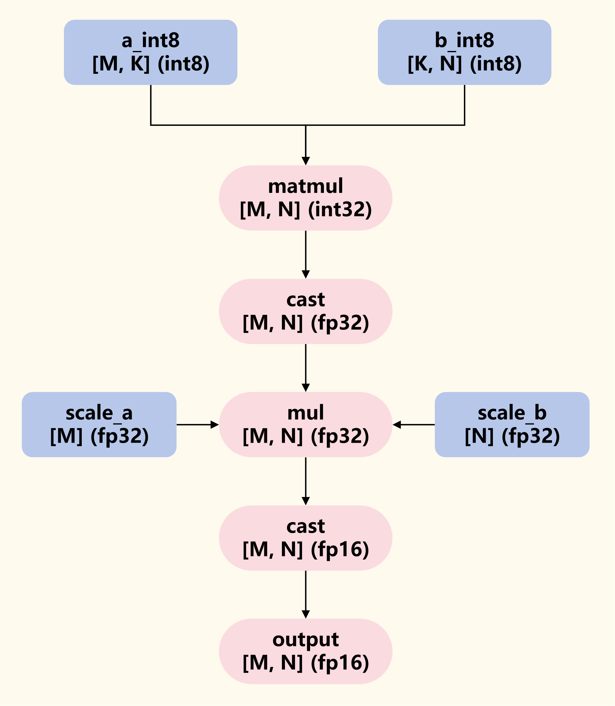
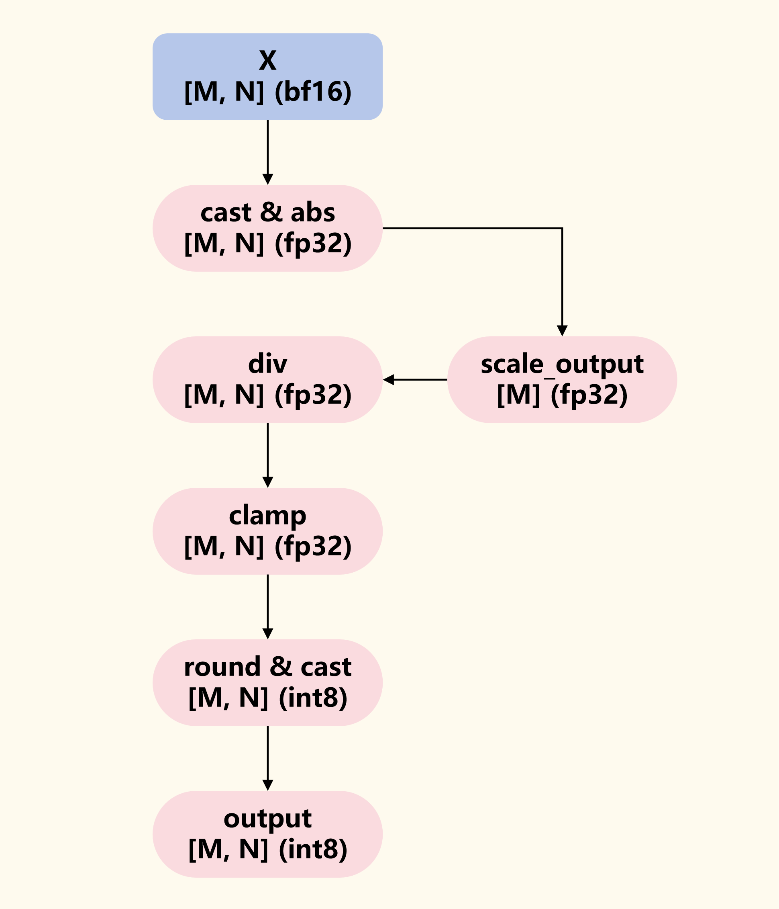

# NPU DeepSeek-V4 TileLang算子开发实践
## 简介

在大模型异构计算发展背景下，GPU 端成熟模型及新算子向昇腾 NPU 的跨平台迁移，Tilelang-Ascend 作为昇腾 CANN 生态原生算子开发框架，深度契合昇腾 NPU 硬件架构特性，采用声明式编程范式大幅降低开发门槛。框架内置丰富硬件原语与性能优化策略，可充分释放 NPU 算力，同时具备极强的新算子快速适配能力，支持 GPU 算子逻辑高效迁移重构，无需深入底层硬件细节即可完成算子开发优化，显著缩短迁移周期。[Tilelang-Ascend代码仓](https://github.com/tile-ai/tilelang-ascend)，助力开发者快速开展昇腾平台算子开发工作。同时在此工作中，我们也覆盖了 [TileKernels](https://github.com/deepseek-ai/TileKernels) 中的mhc算子。


## HighLights

Tilelang-Ascend具有适配大模型开发的显著优势。

在开发易用性方面，Tilelang-Ascend致力于实现语法简洁、思路清晰的编程模式，用简单代码实现高性能复杂算子：

- **易用性强。**高性能、低开发门槛，开发者可以专注于算法逻辑，忽略底层同步、内存等细节。
- **后端语言灵活。**灵活后端语言切换，既有稳定的AscendC编程路径，也有跨代际兼容的高性能PTO编程路径，能够自动适配不同层级、硬件场景。
- **算子快速开发。**Tilelang-Ascend用极短的时间实现了DeepSeek新模型中SFA/MHC等复杂融合算子，开发者可以快速利用Tilelang抽象建立算子模型，并且有多种优化路径可选。

在功能支撑方面，Tilelang-Ascend同样以提升框架便捷性和高效性为核心，Developer模式的框架新特性包含了以下新功能：

- **自动流水同步。**CV 核间由硬件流水自动同步，Tilelang-Ascend 自动化分析生成精准同步指令，保障算子执行正确与高效。
- **自动内存复用。**Tilelang-Ascend 自动完成内存规划与复用，分析生命周期并线性扫描分配，提升 NPU 内存利用率与执行效率。
- **自动拆分跨核指令。**Tilelang-Ascend 编译器自动识别 CV 核操作，支持指令混合编写，自动完成同步调度与依赖管理。
- **流水并行语法糖。**T.Pipelined特性在编译时静态分析与代码转换，实现计算与内存的重叠执行，最大化硬件利用率，显著提升计算密集任务的执行性能。
- **数据并行语法糖。**T.Parallel特性用直观语法表达Tile元素向量化计算并实现数据并行，不暴露底层硬件细节，提升编程体验与效率。


## Tilelang-Ascend框架特性介绍

Tilelang-Ascend持续致力于在提升开发易用性、降低开发难度和代码量上努力。本次框架升级支持了Developer特性开发模式，包括硬件流水自动同步（核间与核内同步）、内存地址自动复用、自动拆分CV指令，及T.Parallel等核心原语操作，从底层简化算子开发流程。原需手动实现的核间同步、内存规划、算力分配等复杂操作，均由原语自动完成，开发者无需深入硬件底层细节，大幅降低对硬件认知的门槛。同时T.Parallel、T.Pipelined原语高效支撑并行计算开发，从算力调度到资源复用全流程自动化，显著降低开发难度、减少代码量，让开发者聚焦核心算法设计，提升算子开发效率与落地速度。

#### 1、硬件流水自动同步

昇腾NPU芯片集成的Cube、Vector等计算单元是异步执行的，CV核间同步通过硬件流水自动对齐各核执行节拍，避免手动栅栏与等待；核内同步由原语在指令级插入依赖与顺序控制，确保数据就绪与访存一致。开发者只需声明并行与流水边界，即可在多核协同与单核流水间获得稳定、高效的执行。

Tilelang-Ascend通过自动化分析**实现同步指令的精准生成，兼顾算子执行的正确性与运行性能**。下图介绍了硬件流水自动同步插入的实现逻辑：

<p align="center">
  
  <center>硬件流水自动同步流程图</center>
</p>

- **循环与处理**：通过将for循环递归展开两份，准确分析嵌套循环中的依赖关系。

- **Buffer访问分析**：结合预定义配置集合，确定指令操作所属的硬件流水线，并解析对Buffer的读写操作。

- **依赖分析与同步决策**：识别数据依赖并根据硬件特性决策同步插入的类型，并通过同步图剔除冗余指令。
  - 识别 RAW（写后读）、WAW（写后写）、WAR（读后写）三类数据依赖。
  - 根据依赖关系和硬件特性，决策同步类型：同流水线用PipeBarrier，跨流水线用EventPair（SetFlag/WaitFlag）。

- **指令生成与循环重构**：展开后的循环进行重构，得到原始嵌套结构并生成指令代码。

**硬件流水自动同步开启方式**：

```python
pass_configs = {
    tilelang.PassConfigKey.TL_ASCEND_AUTO_CV_SYNC: True, # CV核间流水自动同步
    tilelang.PassConfigKey.TL_ASCEND_AUTO_SYNC: True,    # 核内流水自动同步
}
```


#### 2、内存规划与复用

内存规划与复用由框架自动完成，开发者无需手动分配与回收。传统的手动规划内存与手动复用存在很多挑战，开发效率低下，需要人工计算每个层级的偏移量，且算子迭代成本高；并且开发过程中容易出错、难以调试。Tilelang-Ascend根据算子依赖关系与生命周期分析，**智能布局缓冲区与中间张量，减少碎片与冗余拷贝**；同时**通过地址复用与双缓冲策略，在保持数据一致性的前提下复用空闲内存，显著降低峰值占用**。配合流水并行与算力调度，内存访问更连贯，整体带宽利用率与执行效率同步提升。

下图展示了内存自动规划与复用的实现逻辑：

<p align="center">
  
  <center>内存规划与复用流程图</center>
</p>

Tilelang-Ascend通过Developer模式带来了内存规划与复用特性，它完全替代人工 Offset 计算，开发效率显著提升，维度 / 类型变更无需手动适配。自动规避地址重叠、对齐错误，消除内存超限 / 执行异常的人为因素。自动考虑内存复用降低总占用率 ，最大化利用昇腾 NPU 有限的共享内存资源。该特性 是面向昇腾NPU的核心内存优化组件，通过精准的缓冲区生命周期分析与高效的线性扫描内存分配算法，为每个buffer分配内存空间，提高昇腾NPU内存利用率。

- **缓存区生命周期分析**：
  - 遍历 TIR 抽象语法树（AST），全量采集昇腾 NPU 共享内存缓冲区的访问行为。
  - 标记每个缓冲区的 GEN（生成）/KILL（销毁）事件，精准界定其活跃区间 [start, end]（首次使用→最后一次使用的执行阶段）。
  - 按昇腾硬件内存域分组缓冲区，适配不同分区的内存上限约束。
- **线性扫描分配算法**：
  - 按活跃区间起始位置排序缓冲区，构建线性执行序列。
  - 维护活跃队列与空闲内存块池，循环处理每个缓冲区的分配需求。
  - 智能分配策略：优先复用已释放的空闲内存块，无可用块时分配新内存，所有操作遵循 32 字节硬件对齐规则。
  - 最终生成缓冲区到物理地址 Offset 的映射表（address_map），固化到函数属性指导执行。

**内存自动规划与复用开启方式**：

```python
pass_configs = {
    tilelang.PassConfigKey.TL_ASCEND_MEMORY_PLANNING: True, # 内存自动规划与复用
}
```


#### 3、自动拆分CV指令

在昇腾NPU编程中，开发者面临着一种非自然的编程约束。由于硬件架构的CV分离特性，开发者必须在代码中明确标注每段代码属于Cube还是Vector单元。这种显式作用域声明方式会带来开发困扰：开发的割裂性破坏了代码的连贯性；CV频繁切换导致代码和开发逻辑破碎；同时会导致代码结构重复、调试跳跃性强，定位问题困难。例如在Flash Attention融合算子中，Vector核上的Softmax计算和Cube核上的矩阵乘计算会有多次复用同步的逻辑，人工拆分对开发者并不友好。

为了解决这些问题，CV代码分离优化Pass应运而生。它的核心理念是：让开发者专注于算法逻辑，让编译器处理硬件适配。**开发者按算法逻辑自然编写代码，Pass自动识别哪些操作属于Cube，哪些属于Vector**。

<p align="center">
  
  <center>CV指令自动拆分示意图</center>
</p>

如上图所示，Tilelang-Ascend的Developer模式允许用户忽略底层CV核的指令和硬件差异，编写符合正常算法逻辑的代码。

CV自动同步在编译期构建Cube/Vector依赖图，识别跨核读写与数据就绪点，自动插入同步指令与等待机制，并进行流水重排与双缓冲优化，保证核间数据一致与顺序正确。开发者仅需描述算法，编译器即可完成核间调度与核内依赖管理，减少手工拆分与同步代码。

**自动拆分CV指令开启方式**：

```python
pass_configs = {
    tilelang.PassConfigKey.TL_ASCEND_AUTO_CV_COMBINE: True, # 自动拆分CV指令
}
```


#### 4、T.Parallel

Tilelang-Ascend编程模型中，T.Parallel是用于表达 tile 内元素向量化计算 的核心原语。它在 IR 层以“并行循环”的形式描述数据并行，而不直接暴露底层硬件指令细节，可以**让用户用符合编程思维的逐元素编程语法，实现硬件层面Tile级的高性能并行操作**，极大的提升用户的算子编程体验。

目前支持的双目运算符、支持的单目运算符、多运算场景、1D / 2D 场景、双目“向量 + 标量”场景、行切分场景、Buffer + 标量广播运算、拷贝场景。

**代码使用方式示例：**

- **运算操作**：

```python
# 一维运算场景
for i in T.Parallel(v_block):
    m_i[i] = T.max(m_i[i], m_i_prev[i])
```

```python
# 二维运算场景
for (i, j) in T.Parallel(v_block, d):
	acc_o_ub[i, j] /= T.exp(attn_sink_ub[i] - scores_max[i])
```

- **拷贝操作**：

``` python
# GM -> UB 拷贝&计算场景
for i, j in T.Parallel(block_M // VEC_NUM, block_N):
	C[bx * block_M + vid * block_M // VEC_NUM + i, by * block_N + j] = T.exp(a_ub[i, j])
```


## 主要算子实现

本章介绍DeepSeek-V4 0Day支持中Tilelang-Ascend实现的四个算子用例。

### Tilelang算子优势

多个融合算子已经成功适配并接入DeepSeek模型，Tilelang-Ascend在精细化Tile编程中具有语法简洁、先天适配NPU多级存储模型的优势，开发者可以快速简洁地开发Tilelang算子，结合上述Developer模式新特性，在保持相近性能的前提下，代码量可降低至原后端实现的约20%，开发者能用简短的代码实现高性能的复杂算子。

### 1、Sparse Flash Attention

#### **概述**

SparseFlashAttention算子的整体计算流程如下图所示：

<p align="center">
  
  <center>SparseFlashAttention计算流程图</center>
</p>

在DeepSeek-V4模型中，随着上下文长度不断变大，面对超长序列，注意力机制成为模型中的主要计算瓶颈。为了高效计算注意力，SFA（Sparse Flash Attention）在保留原有稀疏索引筛选功能的基础上，改进计算流程并接入了C4A（Compress-4-Attention）和C128A（Compress-128-Attention）稀疏注意力压缩架构，显著降低了长文本场景中注意力的计算成本。新版的SFA算子还引入了可学习注意力锚点（Attention sink）机制，通过调整每个查询头的注意力分数，保护模型输出序列的稳定性。

#### 算法流程详解

从NPU的块级执行视角，结合具体维度阐述实现细节。输入输出张量以典型维度为例：

- **query**: [b, m, h, d]，查询向量集合。
- **key/value**: [b, n, d]，键值向量集合。
- **topk_idxs**: [b, m, k]，topk索引向量。
- **attn_sink**: [h]，attn sink注意力锚点向量。
- **output**: [b, m, h, d]，注意力权重输出向量。

**计算流程：**

##### 1、查询块加载

- **数据并行策略：**将batch和m（序列长度）作为核间并行切分维度，分核执行；设置C:V核1:2比例，以`[head // 2, block=64]`为基础块大小细粒度核内切分张量并行执行。
- **数据切分细节：**按照核间并行-核内切分的双重并行策略进行。
  - 以batch*m为逻辑核core_id数，在AiCores上均匀分配任务。
  - 主块大小为dim=512（`Shape -> [32, 512]`），核内切分块大小为block=64（`Shape -> [32, 64]`）。


##### 2、稀疏键值索引构建掩码块

- **索引驱动加载**：根据mask规则，对基本块中每个数据的位置，利用topk_idxs张量筛选计算得到key/value关联的idxs_ub索引张量：

  - `for i in T.serial(block):`

    `idxs_ub[i] = topk_idxs[by, bx, t * block + i] if t * block + i < topk else -1`

- **构建掩码块**：根据idxs_ub索引张量，筛选参与注意力计算的key值(kv_ub)，并构建存储注意力分数计算结果的掩码矩阵(acc_s_ub)。


##### 3、注意力分数计算

- **矩阵乘：**在Cube核上使用gemm_v0接口计算注意力分数矩阵乘结果，累加存储到L0C buffer上，计算逻辑为：
  - `attn_tile = query @ key.T  Shape -> [64, 64]`

- **注意力掩码累加：**将掩码矩阵累加到矩阵乘的注意力分数结果上，得到掩码后的注意力分数值，并与缩放scale相乘。


##### 4、Online Softmax

- 在注意力分数结果上分块执行在线softmax。

- **数据并行：**利用Tilelang框架新特性T.Parallel，用逐元素计算代码表达Tile块级数据并行计算：

  - `for (i, j) in T.parallel(v_block, block):`

    ​	`acc_s_ub[i, j] -= scores_max[i]`

- 计算过程中通过规约动态维护最大值(score_max)和指数和(score_sum)中间统计量，确保数值稳定性。


##### 5、上下文向量计算

- 完成计算图中注意力权重与value的矩阵乘:
  - `attn_tile = score @ value  Shape -> [64, 512]`


##### 6、结果累加与重缩放

- **结果累加：**以block=64的基本Tile块进行循环，累加计算结果到acc_o_ub buffer中。
- **在线重缩放**：循环结束后，利用在线Softmax维护的统计量(score_max, score_sum)，通过向量化操作对累加结果进行全局重缩放，校正分块计算引入的偏差。


##### **7、注意力锚点计算**

- **attn sink注意力锚点：**对累加结果进行attn sink锚点运算，保留前s个token的注意力权重和KV缓存，使输出保留全局上下文，避免结果仅依赖近期token，导致语义陷入局部陷阱或缺失:

  - `for (i, j) in T.Parallel(v_block, d):`

    ​	`acc_o_ub[i, j] /= T.exp(attn_sink_ub[i] - scores_max[i])`


##### 8、结果写回

- **结果保存：**经过缩放与锚点处理的注意力权重结果按块写回全局内存中。


### 2、Manifold-Constrained Hyper-Connections

#### **概述**

Manifold-Constrained Hyper-Connections算子的整体计算流程如下图所示：

<p align="center">
  
  <center>Manifold-Constrained Hyper-Connections计算流程图</center>
</p>

Manifold-Constrained Hyper-Connections（Mhc）是一种通用残差架构优化方案，融合了流形约束+结构化映射技术，Mhc算子主要包含三类可学习映射：预变换映射pre、后变换映射post和跨流连接映射comb，其将超连接（HC）的多路残差跨流映射约束在双随机矩阵流形上，保留多流表达能力的同时恢复恒等映射特性，解决大规模训练的数值不稳定与信号失控问题。

#### 算法流程详解

算子输入输出典型维度张量分析：

- **mixes**: [n, mix_hc]，多流特征输入张量。
- **hc_scale**: [3]，流级缩放系数向量。
- **hc_base**: [mix_hc]，跨流映射初始矩阵向量。
- **hc**: 超参数，流的数量。
- **sinkhorn_iters**: 超参数，Sinkhorn-Knopp的迭代次数。
- **eps**: 超参数，数值稳定epsilon。
- **pre**: [n, hc]，mixes流级缩放预变换输出张量。
- **post**: [n, hc]，残差融合特征流级缩放的后变换输出张量。
- **comb**: [n, hc]，跨流连接映射输出张量。

**计算流程：**

##### 1、多流特征缩放

- **缩放值计算：**首先根据流级缩放系数向量及流的数量，构建每条流向量对应的缩放值hc_scale_shared。
- **计算缩放多流特征：**按基本块大小，将多流特征乘以缩放值后与跨流初始矩阵相加得到：
  - `mixes_shared = mixes_shared * hc_scale_shared + hc_base_shared`


##### 2、计算预变换张量

- 预变换张量控制每条流的输入强度。

- 根据多流特征缩放值，通过Sigmoid缩放+流级参数融合计算预变换张量结果，按基本块Tile，通过乘以scale值控制每条流的输入维度，用 sigmoid 约束结果在稳定区间，然后加eps防止出现零值，计算流程如下：
  - `pre = mixes ⊙ sigmoid(scale) + eps`


##### 3、计算后变换张量

- 后变换张量控制每条流的输出幅度。
- 与预变换处理流程类似，经过Sigmoid缩放+流级参数融合后，后处理张量会乘以2，以适当扩大输出维度：
  - `post= (mixes ⊙ sigmoid(scale)) * 2`


##### 4、指数归一化

- 按基本块读取跨流融合张量comb，即上述经过缩放的多流特征张量，准备计算跨流映射矩阵的双随机投影。
- 通过reduce、sub、exp等运算接口对每个基本块实现softmax指数归一化运算逻辑，同样累加eps避免产生零值，实现特征输出的范围稳定：
  - `comb = comb.softmax(-1) + eps`


##### 5、行列归一化

- **行归一化：**对经过指数归一化的comb基本块首先在行方向做整体归一化：

  - `comb = comb / (comb.sum(-2) + eps)`

- **迭代行列归一化：**基于Sinkhorn-Knopp算法，按基本块对comb执行总共sink_iter次行列归一化：

  - `for i in range(sink_iter):`

    ​	`comb = comb / (comb.sum(-1) + eps)`

    ​	`comb = comb / (comb.sum(-2) + eps)`

- 最终得到归一化后的comb跨流连接映射输出张量。


##### 6、结果写回

- **结果保存：**将跨流连接映射输出张量结果按块写回全局内存中。


### 3、Int8 General Matrix Multiplication

#### **概述**

Int8 General Matrix Multiplication算子的整体计算流程如下图所示：

<p align="center">
  
  <center>Int8 General Matrix Multiplication计算流程图</center>
</p>

Int8_gemm（Int8 General Matrix Multiplication）是带有量化激活输入值的MatMul算子，将int8类型的输入值的矩阵乘结果反量化为fp32，经过缩放因子缩放后，再次量化到目标数据类型，并保存输出结果。

#### 算法流程详解

算子输入输出典型维度张量分析：

- **a_int8**: [M, K]，int8激活值向量。
- **a_scales**: [M, 1]，激活值缩放因子。
- **b_int8**: [N, K]，int8权重向量。
- **b_scales**: [N, 1]，权重缩放因子。
- **output**: [M, N]，量化gemm输出向量。

**计算流程：**

##### 1、int8矩阵乘法

- **矩阵乘：**分块读入并使用gemm_v0接口计算矩阵乘结果，输入值为int8类型，存储中间结果为int32类型:
  - `C_tile = A_tile @ B_tile.T  Shape -> [64, 64]`
- **运算结果传递：**利用GM workspace将运算结果写入c_ub buffer中。


##### 2、数据类型转换

- **int32->fp32转换：**利用cast接口执行数据类型转换：
  - `T.tile.cast(c_scale, c_ub)  Type: int32 -> float32`


##### 3、反量化缩放

- **加载缩放因子：**将激活值和权重缩放因子按基本分块大小拷贝至ub buffer。

- **转换数据缩放：**将转换后的数据与缩放因子相乘，同样从Tile层级数据并行计算：

  - `for (i, j) in T.Parallel(block_M_2, block_N):`

    ​	`c_scale[i, j] *= scale_a_ub[i]`

    ​	`c_scale[i, j] *= scale_b_ub[j]`


##### 4、结果转换与写回

- 类型转换：再次通过cast将缩放结果转换为目标输出数据类型（以fp16为例）:
  - `T.tile.cast(c_out, c_scale)  Type: float32-> float16`
- **结果保存：**经过类型转换与反量化缩放的结果按块写回全局内存中。


### 4、Activation Quantization

#### **概述**

Activation Quantization算子的整体计算流程如下图所示：

<p align="center">
  
  <center>Activation Quantization计算流程图</center>
</p>

Act_quant（Activation Quantization）是处理激活量化的算子，负责将模型前向推理时动态生成的激活值从高精度（FP32/FP16）转换为低精度（INT8/INT4），主要在模型反向传播或推理后完成量化。

#### 算法流程详解

算子输入输出典型维度张量分析：

- **x_bf16**: [M, N] / [batch, seq, N]，待处理输入张量。
- **round_scale**: False，bool值，是否对缩放因子取整为2的幂次。

**计算流程：**

##### 1、最大值计算

- **数据预处理：**首先把读入的数据转换为fp32类型，然后求取其绝对值数据。
- **最大值：**对列方向进行最大值规约得到输入数据每列的最大值，并存储到max_ub buffer中。


##### 2、计算缩放因子

- 使用每列计算出的最大值除以int8类型的最大值127，根据round_scale判断是否取整为2的幂次，然后得到每个元素的缩放因子：

  - `for i in T.Parallel(block_M_2):`

    ​	`scale_ub[i] = max_ub[i] / int8_abs_max`


##### 3、int8对称量化

- **数据缩放：**将第一步处理的数据除以缩放因子，并通过clamp接口将数据限制在[-127, 127]范围内。
- **对称量化：**将上述数据四舍五入取整，然后先后量化为fp16和int8类型，得到量化输出结果。
- 整体计算流程可概括为：
  - `y = round(clamp(x / scale, -127, 127)).to(float16).to(int8)`


##### 4、结果写回

- 将结算得到的缩放因子向量scale_ub和量化激活值y_ub写回全局内存中。
