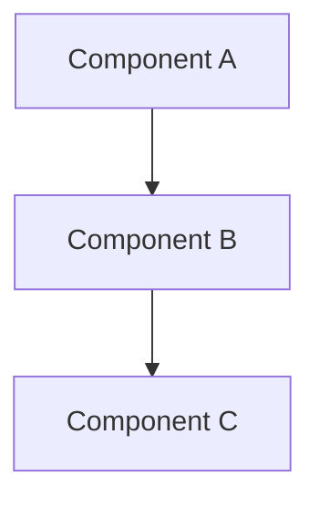

# Blog Post Templates

Complete templates for different types of AI technical blog posts.

## Table of Contents

1. [Research Paper Blog](#research-paper-blog-template)
2. [Engineering Blog](#engineering-blog-template)
3. [Tutorial/How-To Blog](#tutorialhow-to-blog-template)
4. [Personal Reflection Blog](#personal-reflection-blog-template)
5. [Quick Notes Blog](#quick-notes-blog-template)

---

## Research Paper Blog Template

> Use for: Summarizing research papers, explaining novel techniques, discussing findings

### Metadata Section
```markdown
---
## 📌 Article Metadata

- **Paper**: [Paper Title]
- **Authors**: [Author Names]
- **Venue**: [Conference/Journal] [Year]
- **Link**: [arXiv/PDF URL]
- **Reading Time**: [X] min read
- **Date**: [YYYY-MM-DD]
---
```

### Problem Statement
```markdown
### Why This Matters

[2-3 paragraphs explaining the problem context]

**The Challenge**: [One-sentence problem description]

> "The key question is: [core research question]"
```

### Key Contributions
```markdown
### Core Contributions

1. **[Contribution 1]**: [Brief description]
2. **[Contribution 2]**: [Brief description]
3. **[Contribution 3]**: [Brief description]
```

### Technical Approach
```markdown
### How It Works

#### Overview
[High-level description of the method]

#### Key Components

**1. [Component Name]**
[Description + intuitive explanation]

```python
# Pseudocode/example
def component():
    # Explanation
    pass
```

**2. [Component Name]**
[Description]
```

### Results
```markdown
### Key Findings

| Metric | Baseline | This Method | Improvement |
|--------|----------|-------------|-------------|
| [Metric 1] | [Value] | [Value] | [+X%] |
| [Metric 2] | [Value] | [Value] | [+X%] |

> **Notable**: [Interesting observation from results]
```

### Discussion
```markdown
### Why It Works

[Explanation of why the method is effective]

### Limitations

- **Limitation 1**: [Description]
- **Limitation 2**: [Description]

### Future Directions

[What the authors suggest or what could come next]
```

### Conclusion
```markdown
### Takeaways

1. **[Point 1]**: [One sentence]
2. **[Point 2]**: [One sentence]
3. **[Point 3]**: [One sentence]

---

### References

- [Paper](URL) - [Full citation]
- [Related work 1](URL) - [Connection]
- [Code implementation](URL) - [If available]
```

---

## Engineering Blog Template

> Use for: System design, infrastructure, "how we built" posts, scaling stories

### Metadata Section
```markdown
---
## 📌 Post Metadata

- **System/Feature**: [Name]
- **Scale**: [e.g., 800M users, 1M QPS]
- **Team**: [Team name]
- **Reading Time**: [X] min read
- **Date**: [YYYY-MM-DD]
---
```

### Background
```markdown
### Problem Background

[2-3 paragraphs: What problem are we solving? Why now?]

**Current State**: [Description of existing solution and its pain points]

> "The key challenge was: [one-sentence problem summary]"
```

### Architecture Overview
```markdown
### System Architecture

[Architecture description]



**Core Components:**

1. **[Component 1]**: [Responsibility]
2. **[Component 2]**: [Responsibility]
3. **[Component 3]**: [Responsibility]
```

### Challenges & Solutions
```markdown
### Key Challenges

#### Challenge: [Challenge Title]

[Describe the problem and its impact]

**_Impact_**: [How this affected the system/users]

**_Solution_**: [What we did]

[Technical details with code if relevant]

---

#### Challenge: [Challenge Title]

[Same structure as above]
```

### Results
```markdown
### Results

**Performance Improvements:**

| Metric | Before | After | Improvement |
|--------|--------|-------|-------------|
| Latency (p99) | [X]ms | [Y]ms | [Z]% ↓ |
| Throughput | [X] QPS | [Y] QPS | [Z]x ↑ |
| Cost | $[X] | $[Y] | [Z]% ↓ |

**Reliability:**
- Uptime: [Percentage] over [period]
- SEV-0 incidents: [Number] in [period]
```

### Lessons Learned
```markdown
### What We Learned

**✅ What Worked:**
- [Success 1]
- [Success 2]

**❌ What Didn't:**
- [Failure 1] → [How we fixed it]
- [Failure 2] → [How we fixed it]
```

### Conclusion
```markdown
### Looking Forward

[Next steps, future plans]

---

### Acknowledgements

[Thank team members, collaborators]
```

---

## Tutorial/How-To Blog Template

> Use for: Explaining concepts, teaching techniques, practical guides

### Hook
```markdown
### Introduction

[Hook: Why this topic matters now]

**By the end of this post, you'll:**
- [Learning objective 1]
- [Learning objective 2]
- [Learning objective 3]

**Prerequisites**: [What readers should know beforehand]
```

### Core Concepts
```markdown
### Key Concepts

#### [Concept 1]
[Simple explanation with example]

```python
# Example
example = demonstration()
```

#### [Concept 2]
[Simple explanation]
```

### Step-by-Step Guide
```markdown
### Implementation

#### Step 1: [Step Title]

[What to do + why]

```python
# Code with comments
def step1():
    # Explanation
    pass
```

**Common pitfall**: [What to watch out for]

#### Step 2: [Step Title]
[Continue with remaining steps]
```

### Full Example
```markdown
### Putting It All Together

[Complete working example]

```python
# Full implementation
def complete_example():
    # All steps combined
    pass
```

**Expected output**: [What readers should see]
```

### Tips & Tricks
```markdown
### Pro Tips

- **Tip 1**: [Description]
- **Tip 2**: [Description]
- **Tip 3**: [Description]

### Common Mistakes

| Mistake | Why It Happens | Fix |
|---------|---------------|-----|
| [Mistake] | [Cause] | [Solution] |
```

### Further Reading
```markdown
### Learn More

- [Resource 1](URL) - [Description]
- [Resource 2](URL) - [Description]
- [Resource 3](URL) - [Description]

---

### Try It Yourself

[Exercise or challenge for readers]
```

---

## Personal Reflection Blog Template

> Use for: Career reflections, lessons learned, growth mindset posts

### Trigger
```markdown
### The Trigger

[What prompted this reflection?]

[Context: When, where, what happened]
```

### Story
```markdown
### My Story

#### Background
[Set the scene - what was your situation?]

#### The Challenge
[What difficulty did you face?]

#### The Journey
[What did you try? What happened?]
```

### Key Insights
```markdown
### What I Learned

#### Insight 1: [Title]

**The Learning**: [What you discovered]

**Why It Matters**: [Why this is important]

**How I Apply It**: [Practical application]

#### Insight 2: [Title]
[Continue for additional insights]
```

### Before & After
```markdown
### How I Changed

**Before**: [What you used to think/believe]

**After**: [What you think/believe now]

> "The biggest shift for me was [key change]"
```

### Action Items
```markdown
### What's Next

**Immediate (this week):**
- [ ] [Action 1]
- [ ] [Action 2]

**Short-term (this month):**
- [ ] [Action 3]
- [ ] [Action 3]

**Long-term (this quarter):**
- [ ] [Action 5]
```

### Acknowledgements
```markdown
### Gratitude

[Thank people who helped you]

Big thanks to [Names] for [specific help].

### Final Thoughts

[Closing reflection or advice to readers]
```

---

## Quick Notes Blog Template

> Use for: Brief updates, quick thoughts, work-in-progress ideas

### The Idea
```markdown
### Quick Take: [Title]

[Core idea - 2-3 paragraphs]

**Context**: [Why this matters now]
```

### Key Points
```markdown
### Main Points

- [Point 1]
- [Point 2]
- [Point 3]

> "Tweetable summary" (~280 chars)
```

### Next Steps
```markdown
### What's Next

- [ ] Follow up on [X]
- [ ] Research [Y]
- [ ] Write full post on [Z]

**Status**: 🔄 Work in progress / 💡 Idea / ✅ Complete
```

---

## Template Selection Guide

| Post Type | Use When... | Recommended Style |
|-----------|-------------|-------------------|
| Research Paper | Explaining a paper, novel technique | Anthropic/Karpathy |
| Engineering | System design, infrastructure, scaling | OpenAI Engineering |
| Tutorial | Teaching a concept or technique | Karpathy |
| Personal Reflection | Career, lessons learned, growth | Yi Tay |
| Quick Notes | Brief updates, WIP ideas | Any concise style |

---

## Common Sections Across All Templates

### Metadata (always include)
```markdown
---
- **Reading Time**: [X] min read
- **Date**: [YYYY-MM-DD]
- **Tags**: [tag1, tag2, tag3]
---
```

### Code Style (always use)
```python
# Key intuition: [explanation]
def function_name(param):
    """
    [Brief description]

    Args:
        param: [description]

    Returns:
        [description]
    """
    # Step 1: [action]
    result = process(param)

    # Step 2: [action]
    final = transform(result)

    return final
```

### Figure Captions (always include)
```markdown


**Figure 1**: [Description]. Notably, [key insight].
```

### Table Captions (always include)
```markdown
| Column 1 | Column 2 | Column 3 |
|----------|----------|----------|
| Data 1   | Data 2   | Data 3   |

**Table 1**: [Description of what the table shows].
```
